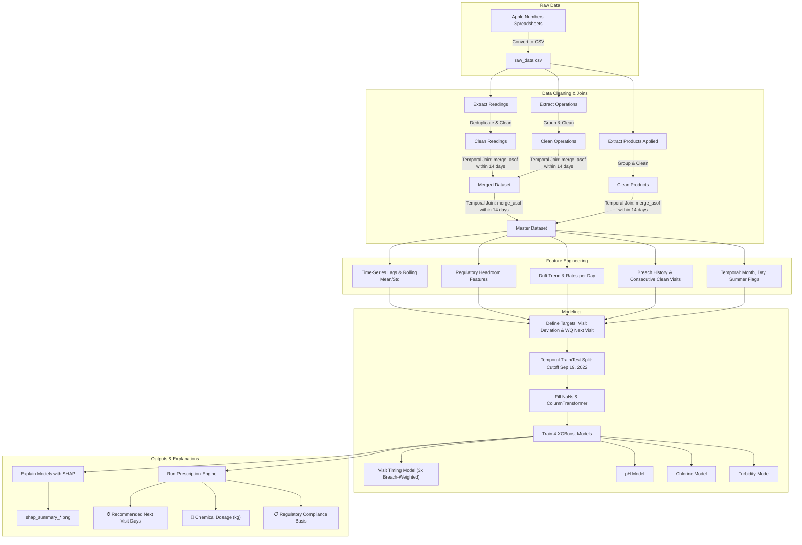
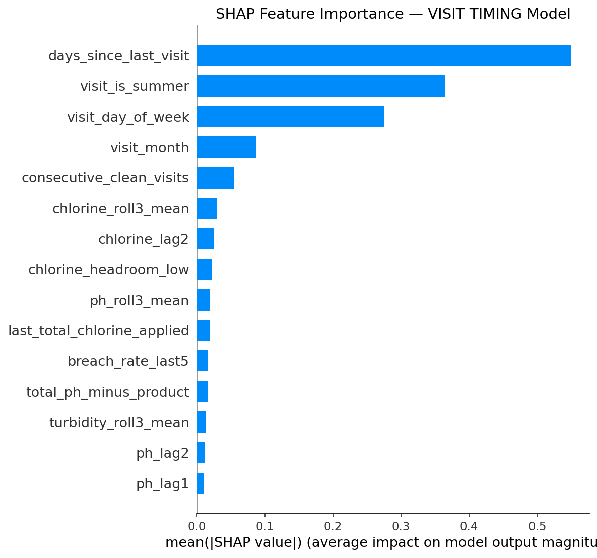
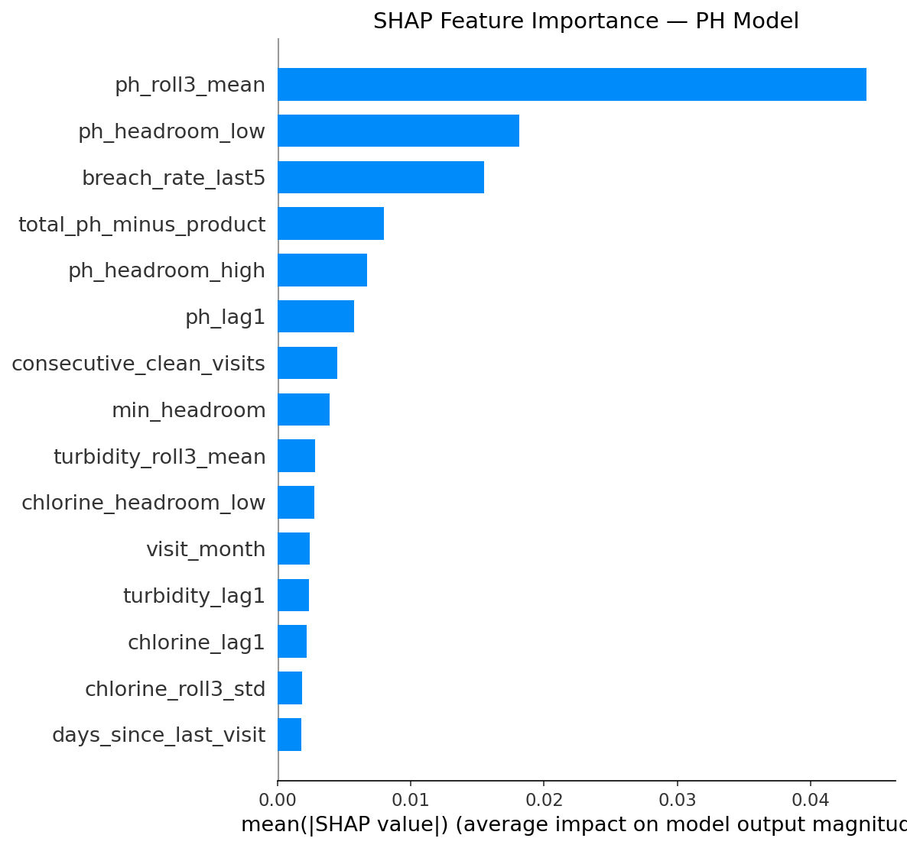
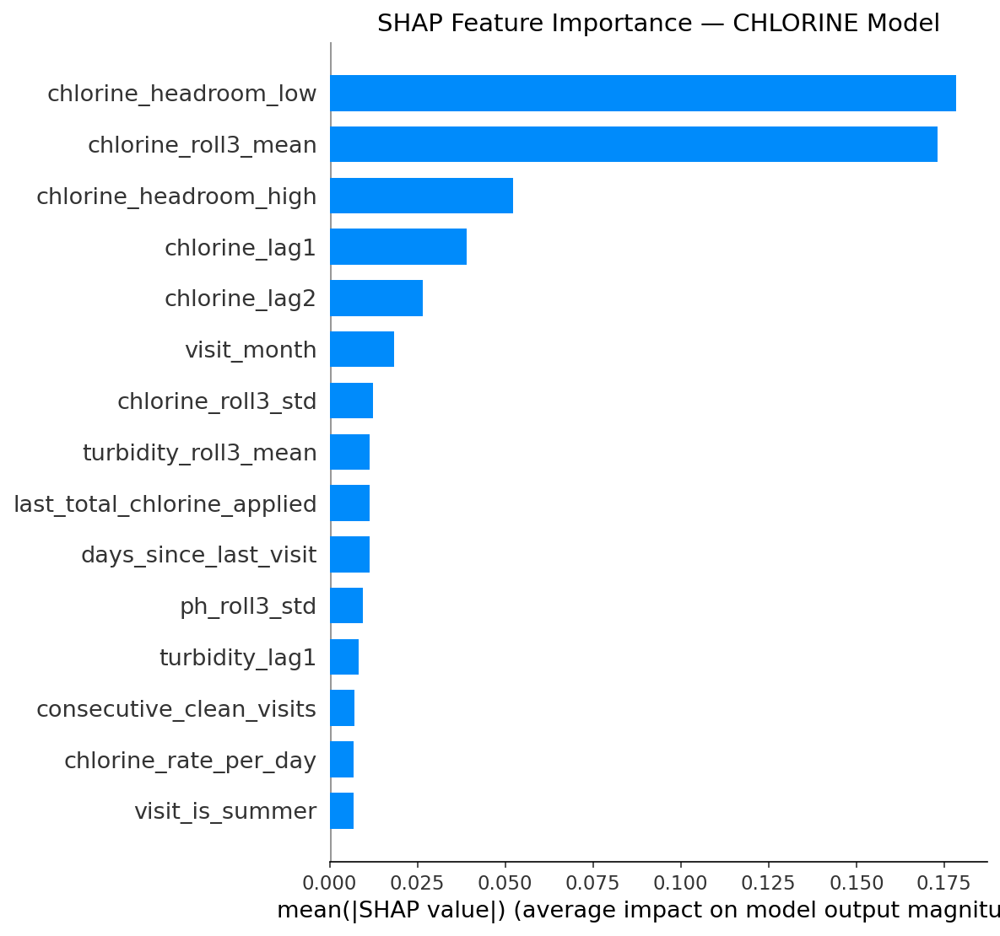
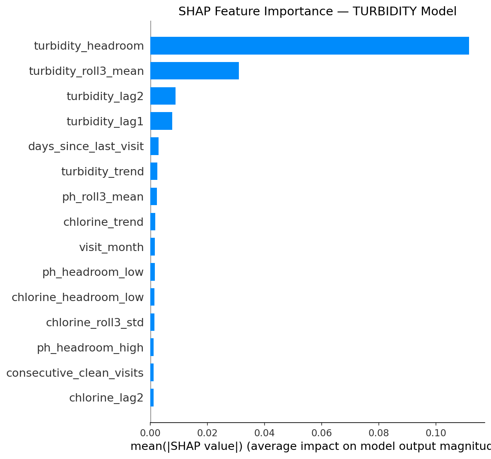

# Pool Predictive Maintenance System — Spain (Alicante) Collective-Use Pools

A machine-learning-driven predictive maintenance pipeline for Spain collective-use pools. This system uses **XGBoost** to forecast water quality parameters (pH, free chlorine, turbidity), predict **when the next technician visit should occur**, and prescribe **precise chemical dosages** (in kilograms) for the technician to bring to the site.

The system is fully grounded in Spanish national and regional pool health regulations:
* **Real Decreto 742/2013** (National Spanish water quality standards for collective-use pools).
* **Decreto 85/2018** of the Comunitat Valenciana (Regional adaptation requiring daily autocontrol logbooks).

---

## 1. End-to-End Pipeline Flow

The following diagram visualizes the data processing, feature engineering, modeling, and prescription pipeline.



---

## 2. Raw Data Characteristics & Quality

The system is built using records provided by the **SPP System** (Pepe Gutiérrez's pool maintenance company) located in Alicante, Spain.

* **Size**: 4,231 rows across 61 columns.
* **Temporal Coverage**: January 1, 2022, to December 31, 2022.
* **Pools Count**: 43 unique physical pools.
* **Post-Cleaning Size**: ~3,400 usable merged records.
* **Structure**: The spreadsheet is highly denormalized, containing three tables written side-by-side in each row:
  1. **Water Quality Readings**: pH, free chlorine, turbidity, pool surface/volume dimensions, deck details, and date/time.
  2. **Operations**: Filtration hours, water temperature, dosing pump flow settings. Only present in **47%** of raw records.
  3. **Chemical Products Applied**: Hand-applied chemical products (liquids, tablets, sticks, granular) by the technician on that day. Present in **90%** of records.

> [!WARNING]
> Many static pool dimensions (volume, filter size, motor count) are **>50% null** in the raw spreadsheet. The pipeline drops dimensions that cannot be reliably filled, relying on median-imputation for remaining numeric features during preprocessing.

---

## 3. Regulatory Grounding: Real Decreto 742/2013

Spain's **Real Decreto 742/2013** specifies the mandatory chemical ranges and safety levels for collective-use pools. A safety breach is defined as any condition that requires immediate correction or forces the pool to close.

| Parameter | Legally Compliant Range | Safety Breach Action | Our Model Action |
|---|---|---|---|
| **Free Chlorine** | `0.5 – 2.0 mg/L` | `< 0.5 mg/L` (Pathogen risk) or `> 5.0 mg/L` (Chemical burns / Mandatory closure) | Set urgency = **IMMEDIATE** + prescribe chlorine dosage |
| **pH** | `7.2 – 8.0` | `< 7.2` or `> 8.0` (Skin/eye irritation, disinfectant inefficacy) | Set urgency = **SOON** / **IMMEDIATE** + prescribe pH corrector |
| **Turbidity** | `≤ 5 NTU` | `> 5 NTU` (Water cloudiness/safety risk) | Set urgency = **SOON** + prescribe flocculant |

### The "60% Chlorine Overdosing" Finding
> [!NOTE]
> 60% of all readings in the Alicante dataset have free chlorine **exceeding 2.0 mg/L** (often between 2.0 and 4.0 mg/L). 
> 
> * **Why**: Technicians intentionally overdose chlorine because collective-use pools in Mediterranean Spain experience fast chlorine degradation due to high UV indexes and unpredictable bather loads.
> * **V1 vs V2**: V1 flagged these as "breaches" (leading to an artificial 68.7% breach rate). V2 uses the corrected safety definitions (`free_chlorine < 0.5` or `free_chlorine > 5.0` as breaches), yielding a realistic and actionable **14.9% safety breach rate** (mostly pH drift).

---

## 4. Feature Engineering

The pipeline processes raw inputs into **38 features** across several categories:

### A. Water Quality History (Lags & Rolling)
* `ph_lag1`, `ph_lag2`: Acidity levels recorded at the previous two visits.
* `chlorine_lag1`, `chlorine_lag2`: Free chlorine levels at the previous two visits.
* `turbidity_lag1`, `turbidity_lag2`: Turbidity at the previous two visits.
* `ph_roll3_mean`, `ph_roll3_std`: Running average and standard deviation of pH (measures stability).
* `chlorine_roll3_mean`, `chlorine_roll3_std`: Running average and standard deviation of chlorine.
* `turbidity_roll3_mean`: Running average of turbidity.

### B. Regulatory Headroom Features
These measure the safety margin before a legal limit is breached:
* `chlorine_headroom_low`: $Chlorine - 0.5$ (Safety buffer above minimum)
* `chlorine_headroom_high`: $5.0 - Chlorine$ (Safety buffer below closure threshold)
* `ph_headroom_low`: $pH - 7.2$ (Buffer above lower pH limit)
* `ph_headroom_high`: $8.0 - pH$ (Buffer below upper pH limit)
* `turbidity_headroom`: $5.0 - Turbidity$ (Buffer below turbidity limit)
* `min_headroom`: The minimum of all headroom values above. A single indicator of proximity to a regulatory infraction.

### C. Drift & Trend Features
* `ph_trend`, `chlorine_trend`, `turbidity_trend`: Change in parameter value since the last visit.
* `ph_rate_per_day`, `chlorine_rate_per_day`, `turbidity_rate_per_day`: Trend divided by the days elapsed since the last visit (velocity of water quality decay).

### D. Historical Breach Tracking
* `current_any_breach`, `current_ph_breach`, `current_chlorine_breach`: Indicators if the current reading is out of bounds.
* `consecutive_clean_visits`: Running count of consecutive visits without any regulatory breach.
* `breach_rate_last5`: Percentage of the last 5 visits that resulted in a regulatory breach.

### E. Operations & Products
* `last_total_chlorine_applied`: Sum in kg of all hypochlorite products applied at the last visit.
* `total_ph_minus_product`: Sum in kg of all acid products applied at the last visit.
* `daily_filtration_hours`: Hours the pump filter was configured to run daily.
* `water_temperature`: Water temperature in °C.

### F. Temporal & Categorical
* `days_since_last_visit`: Operational interval.
* `visit_month`, `visit_day_of_week`, `visit_is_summer`: Seasonality markers.
* `pool_type`, `deck_type`: Categorical markers (one-hot encoded).

---

## 5. The Models

We train **four separate XGBoost regression models**:

```
Prediction = Tree₁(features) + Tree₂(features) + ... + Treeₙ(features)
```

Each tree is built sequentially, learning from the residual errors of the prior trees to optimize predictions.

### Hyperparameters (XGB_PARAMS)
```json
{
  "n_estimators": 500,
  "max_depth": 5,
  "learning_rate": 0.05,
  "subsample": 0.8,
  "colsample_bytree": 0.8,
  "reg_alpha": 0.1,
  "reg_lambda": 1.0,
  "early_stopping_rounds": 50
}
```

### Model Early Stopping Results
Early stopping checks model loss on the test set. If test error does not improve for 50 rounds, training halts to prevent overfitting.
* **Visit Timing Model**: Stopped at **4 trees** (fast convergence, dominated by baseline schedule).
* **pH Model**: Stopped at **78 trees**.
* **Chlorine Model**: Stopped at **117 trees** (more complex chemistry decay patterns).
* **Turbidity Model**: Stopped at **31 trees**.

---

## 6. The Visit Timing Model (Seasonal Deviation)

### The Problem
Technicians follow a strong calendar schedule dictated by the company:
* **Summer (June–September)**: Visited every **2 days** (heavy bather loads, fast chlorine degradation).
* **Winter (November–February)**: Visited every **6–7 days** (idle pools, low chemistry drift).

A naive machine learning model trained on raw days would just learn the calendar date and recommend standard intervals, ignoring actual water quality.

### The Solution: Predict Deviation from Baseline
We calculate the median visit interval for each month of the year (`seasonal_baseline`):

| Month | Jan | Feb | Mar | Apr | May | Jun | Jul | Aug | Sep | Oct | Nov | Dec |
|---|---|---|---|---|---|---|---|---|---|---|---|---|
| **Baseline (Days)** | 7 | 7 | 7 | 7 | 4 | 2 | 2 | 2 | 2 | 6 | 6 | 6 |

Instead of predicting raw days, the model predicts the **deviation**:
$$\text{visit\_deviation} = \text{actual\_days} - \text{seasonal\_baseline}$$

* **Prediction = -2**: Visit 2 days earlier than the seasonal default (water is degrading).
* **Prediction = +3**: Visit 3 days later than the seasonal default (water is highly stable).

The final recommendation is reconstructed as:
$$\text{Recommended Days} = \text{seasonal\_baseline} + \text{predicted\_deviation}$$

### Sample Weighting
To prioritize safety, rows where a **safety breach occurred at the next visit** are weighted **3×** during training. This forces the loss function to penalize errors on breach cases heavily, making the model risk-averse and biasing it to recommend earlier visits when chemistry shows signs of degradation.

---

## 7. Dosage Prescriptions

Three separate regressors predict the water parameter levels for the next visit (`target_ph_next`, `target_chlorine_next`, and `target_turbidity_next`). These predictions feed into our prescription engine:

### Chlorine Prescription
If predicted free chlorine $< 0.5$ mg/L:
$$\text{Chlorine Needed (kg)} = (1.25 - \text{predicted\_chlorine}) \times \text{pool\_volume} \times 0.0025$$

### pH corrector (pH Minus / pH Plus)
If predicted pH $> 8.0$:
$$\text{pH Minus Needed (kg)} = (\text{predicted\_pH} - 7.2) \times \text{pool\_volume} \times 0.001$$
If predicted pH $< 7.2$:
$$\text{pH Plus Needed (kg)} = (7.2 - \text{predicted\_pH}) \times \text{pool\_volume} \times 0.001$$

### Turbidity (Flocculant)
If predicted turbidity $> 2.0$ NTU:
$$\text{Action} = \text{"Add preventive flocculant"}$$
If predicted turbidity $> 5.0$ NTU:
$$\text{Action} = \text{"⚠️ Add flocculant - predicted turbidity exceeds regulatory threshold"}$$

---

## 8. Train/Test Split & Performance

### Temporal Split (Preventing Data Leakage)
We split the data by date to mimic real-world deployment. The cutoff is set at the **80th percentile** of dates:
* **Training Set**: All readings before **September 19, 2022** (2,646 rows)
* **Test Set**: All readings on/after **September 19, 2022** (662 rows)

### Evaluation Metrics

| Model | Target | RMSE | MAE | $R^2$ | Interpretation |
|---|---|---|---|---|---|
| **Visit Timing** | `days_to_next_visit` | 3.15 days | 1.58 days | 0.15 | Recommends intervals within 1.6 days of actual on average. |
| **pH Model** | `target_ph_next` | 0.144 | 0.095 | 0.36 | Average error is ~0.1 pH unit, matching chemical sensor limits. |
| **Chlorine Model** | `target_chlorine_next` | 0.747 | 0.518 | 0.33 | Predicts next chlorine level within 0.5 mg/L on average. |
| **Turbidity Model**| `target_turbidity_next`| 0.213 | 0.116 | 0.43 | Predicts next water clarity within 0.1 NTU. |

> [!NOTE]
> While the $R^2$ of 0.15 for the Visit Timing model is low, this is expected. Scheduling is primarily logistical and seasonal. The model's value is not in replacing the seasonal baseline, but in flagging **individual exceptions** (pools degrading faster than normal).

---

## 9. SHAP Explainability & Feature Importances

SHAP (SHapley Additive exPlanations) values measure how much each feature pushes a model prediction away from the average baseline.

### 1. Visit Timing Model Feature Importance
The model prioritizes operational frequency, calendar constraints, and stability metrics:
1. `days_since_last_visit` (operational scheduling inertia)
2. `visit_day_of_week` (scheduling day constraints)
3. `visit_month` (residual seasonal variations)
4. `chlorine_lag1` (recent chlorine concentration)
5. `chlorine_roll3_std` (variability/instability of chlorine over the last 3 visits)



### 2. Water Quality Models Feature Importance
The newly engineered V2 features (headroom and trends) dominate prediction importances:
* `chlorine_headroom_low` is the **#1 most important feature** for the chlorine prediction model.
* `ph_headroom_low` is the **#2 most important feature** for the pH prediction model.
* `breach_rate_last5` and `consecutive_clean_visits` rank highly across all models, proving that past stability is a strong indicator of future behavior.

````carousel

<!-- slide -->

<!-- slide -->

````

---

## 10. Limitations

* **Static Features Missing**: Static features like pool volume, surface area, and pump motor horsepower are missing in >50% of the raw data. Collecting these variables more rigorously would improve dosage calculations.
* **No Weather API integration**: Sun intensity, precipitation, and temperature directly accelerate chlorine degradation. Future versions could integrate local weather forecasting.
* **Short History**: The dataset spans only one calendar year, making multi-year seasonality impossible to model.
* **No Microbiological Data**: Real Decreto 742/2013 also requires monthly laboratory microbiology tests (e.g., for *Pseudomonas aeruginosa* and *E. coli*). This model only covers the daily autocontrol chemistry parameters.

---

## 11. Codebase Structure

```
swimming_pool_eu/
│
├── pipeline_v2.py             # Main execution script (training + evaluation)
├── pipeline.py                # Legacy V1 pipeline script
├── requirements.txt           # Python dependency specifications
├── raw_data.csv               # Raw dataset (renamed & cleaned column structure)
├── master_dataset.csv         # Feature-engineered combined output CSV
├── evaluation_report.txt      # Text summary of metrics and test prescriptions
├── preprocessor.pkl           # Saved scikit-learn preprocessing ColumnTransformer
├── inference_config.json      # Medians, feature names, and config dictionary
│
├── xgb_visit_timing.json      # Trained XGBoost visit timing model
├── xgb_ph.json                # Trained XGBoost pH model
├── xgb_chlorine.json          # Trained XGBoost chlorine model
├── xgb_turbidity.json         # Trained XGBoost turbidity model
│
├── shap_summary_visit_timing.png  # Feature importance plot (visit timing)
├── shap_summary_ph.png            # Feature importance plot (pH)
├── shap_summary_chlorine.png      # Feature importance plot (chlorine)
└── shap_summary_turbidity.png     # Feature importance plot (turbidity)
```

---

## 12. Setup & Execution

### 1. Prerequisites
Ensure you have **Python 3.10+** installed.

### 2. Create and Activate Virtual Environment
```bash
# Create venv
python3 -m venv venv

# Activate venv (macOS/Linux)
source venv/bin/activate

# Activate venv (Windows)
venv\Scripts\activate
```

### 3. Install Dependencies
```bash
pip install -r requirements.txt
```

### 4. Run the Pipeline
Run the main script to clean data, engineer features, train the models, perform evaluation, output the metrics report, and save the SHAP plots:
```bash
python pipeline_v2.py
```

---

## 13. Example Prescription Output

The combined prescription output details the current pool state, predicts the future state, determines the visit urgency tier (Immediate, Soon, Routine, Extended) with technical reasoning, and provides exact chemical prescriptions:

```yaml
Pool: villamagna (1082)
  Last reading: 2022-09-15 08:30:00
  Current:      pH=7.2, Cl=1.0, Turb=0.2
  Predicted:    pH=7.14, Cl=1.25, Turb=0.32
  ⏱  NEXT VISIT IN: 6 days (Soon)
  📋 Reasons: Predicted pH (7.14) will breach range (7.2–8.0)
  💊 Chlorine: ✅ Chlorine within range (0.0 kg)
  💊 pH: Add pH plus — predicted pH (7.14) below 7.2 (RD 742/2013) (0.06 kg)
  💊 Turbidity: ✅ Turbidity within range
```

---

## 14. License

This project is licensed under the MIT License. All rights and copyright belong to **shaik imaduddin**. See the [LICENSE](file:///Users/imadmac/projects/swimming_pool_eu/LICENSE) file for details.

