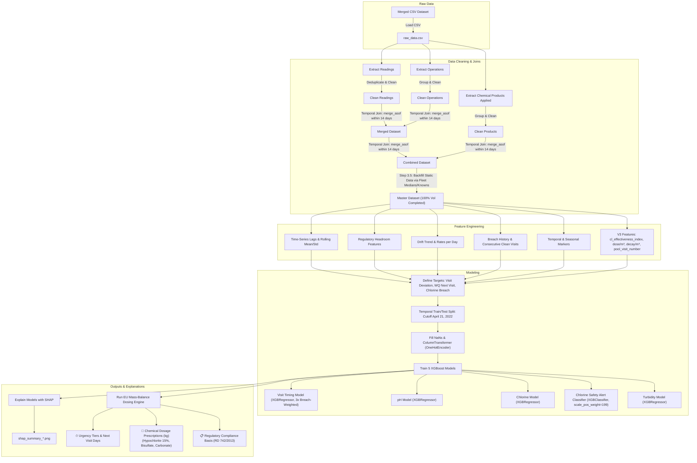

# Pool Predictive Maintenance System — Spain (Alicante) Collective-Use Pools (V3)

A machine-learning-driven predictive maintenance pipeline for Spain collective-use pools. This system uses **XGBoost** to forecast water quality parameters (pH, free chlorine, turbidity), predict **when the next technician visit should occur**, alert on potential **chlorine safety breaches**, and prescribe **precise chemical dosages** (in kilograms) for the technician to bring to the site.

The system is fully grounded in Spanish national and regional pool health regulations:
* **Real Decreto 742/2013** (National Spanish water quality standards for collective-use pools).
* **Decreto 85/2018** of the Comunitat Valenciana (Regional adaptation requiring daily autocontrol logbooks).

---

## 1. End-to-End Pipeline Flow

The following diagram visualizes the V3 data processing, static backfilling, feature engineering, modeling, and prescription pipeline.



---

## 2. Raw Data Characteristics & Quality

The system is built using records provided by the **SPP System** (Pepe Gutiérrez's pool maintenance company) located in Alicante, Spain.

* **Size**: 138,660 rows after merging (historical records from April 25, 2017, to December 30, 2022).
* **Pools Count**: 476 unique physical pools.
* **Temporal Coverage**: 2017 to 2022.
* **Structure**: The raw table is highly denormalized, containing three tables written side-by-side in each row:
  1. **Water Quality Readings**: pH, free chlorine, turbidity, pool surface/volume dimensions, deck details, and date/time.
  2. **Operations**: Filtration hours, water temperature, dosing pump flow settings.
  3. **Chemical Products Applied**: Hand-applied chemical products (liquids, tablets, sticks, granular) by the technician on that day.

> [!IMPORTANT]
> **Static Pool Dimensions Backfill (V3 Improvement)**
> In the raw spreadsheet, static dimensions like pool volume, surface area, filter diameter, and motor count are missing in >98% of the rows (originally, only 1.4% of readings had volume recorded). 
> 
> To enable precise dosing and volume-normalized machine learning, **Step 3.5** propagates each pool's known static variables to all of its corresponding time-series rows. If a pool lacks static records completely, the fleet median is computed and applied. This raises the completeness of these critical volume features from 1.4% to **100%**.

---

## 3. Regulatory Grounding: Real Decreto 742/2013

Spain's **Real Decreto 742/2013** specifies the mandatory chemical ranges and safety levels for collective-use pools. A safety breach is defined as any condition that requires immediate correction or forces the pool to close.

| Parameter | Legally Compliant Range | Safety Breach Action | Our Model Action |
|---|---|---|---|
| **Free Chlorine** | `0.5 – 2.0 mg/L` | `< 0.5 mg/L` (Pathogen risk) or `> 5.0 mg/L` (Chemical burns / Mandatory closure) | Set urgency = **IMMEDIATE** + flag safety alert + prescribe chlorine dosage |
| **pH** | `7.2 – 8.0` | `< 7.2` or `> 8.0` (Skin/eye irritation, disinfectant inefficacy) | Set urgency = **SOON** / **IMMEDIATE** + prescribe pH corrector |
| **Turbidity** | `≤ 5 NTU` | `> 5 NTU` (Water cloudiness/safety risk) | Set urgency = **SOON** + prescribe flocculant |

### The "60% Chlorine Overdosing" Finding
> [!NOTE]
> 60% of all readings in the Alicante dataset have free chlorine **exceeding 2.0 mg/L** (often between 2.0 and 4.0 mg/L). 
> 
> * **Why**: Technicians intentionally overdose chlorine because collective-use pools in Mediterranean Spain experience fast chlorine degradation due to high UV indexes and unpredictable bather loads.
> * **Modeling Impact**: A safety breach is defined strictly as `free_chlorine < 0.5` or `free_chlorine > 5.0` (rather than just > 2.0), ensuring the models focus only on genuine hazard states.

---

## 4. Feature Engineering

The V3 pipeline processes raw inputs into **57 features** across several categories:

### A. Water Quality History (Lags & Rolling)
* `ph_lag1`, `ph_lag2`: Acidity levels recorded at the previous two visits.
* `chlorine_lag1`, `chlorine_lag2`: Free chlorine levels at the previous two visits.
* `turbidity_lag1`, `turbidity_lag2`: Turbidity at the previous two visits.
* `ph_roll3_mean`, `ph_roll3_std`: Running average and standard deviation of pH.
* `chlorine_roll3_mean`, `chlorine_roll3_std`: Running average and standard deviation of chlorine.
* `turbidity_roll3_mean`: Running average of turbidity.

### B. Regulatory Headroom Features
These measure the safety margin before a legal limit is breached:
* `chlorine_headroom_low`: $Chlorine - 0.5$ (Safety buffer above minimum)
* `chlorine_headroom_high`: $5.0 - Chlorine$ (Safety buffer below closure threshold)
* `ph_headroom_low`: $pH - 7.2$ (Buffer above lower pH limit)
* `ph_headroom_high`: $8.0 - pH$ (Buffer below upper pH limit)
* `turbidity_headroom`: $5.0 - Turbidity$ (Buffer below turbidity limit)
* `min_headroom`: The minimum of all headroom values above. A single indicator of proximity to a regulatory infraction.

### C. Drift & Trend Features
* `ph_trend`, `chlorine_trend`, `turbidity_trend`: Change in parameter value since the last visit.
* `ph_rate_per_day`, `chlorine_rate_per_day`, `turbidity_rate_per_day`: Trend divided by the days elapsed since the last visit (velocity of water quality decay).

### D. Historical Breach Tracking
* `current_any_breach`, `current_ph_breach`, `current_chlorine_breach`: Indicators if the current reading is out of bounds.
* `consecutive_clean_visits`: Running count of consecutive visits without any regulatory breach.
* `breach_rate_last5`: Percentage of the last 5 visits that resulted in a regulatory breach.

### E. Operations & Products
* `last_total_chlorine_applied`: Sum in kg of all hypochlorite products applied at the last visit.
* `total_ph_minus_product`: Sum in kg of all acid products applied at the last visit.
* `daily_filtration_hours`: Hours the pump filter was configured to run daily.
* `water_temperature`: Water temperature in °C.

### F. Temporal & Categorical
* `days_since_last_visit`: Operational interval.
* `visit_month`, `visit_day_of_week`, `visit_is_summer`: Seasonality markers.
* `pool_type`, `deck_type`: Categorical markers (one-hot encoded).

### G. Practical & Chemistry Interaction Features (New in V3)
* `cl_effectiveness_index`: pH-Chlorine Effectiveness Index. Accounts for the dissociation of Hypochlorous acid (HOCl) at higher pH levels. Disinfectant active chlorine drops off rapidly as pH rises above 7.5; this index penalizes free chlorine levels proportionally.
* `chlorine_dose_per_m3` & `ph_minus_dose_per_m3`: Volume-normalized chemical loads (in kg/$m^3$), allowing the model to learn dosage concentrations.
* `chlorine_decay_per_m3`: Volume-normalized rate of chlorine decay per day.
* `pool_visit_number`: Running counter of technician visits, capturing seasonal/temporal cycle depth.

---

## 5. The Models

We train **five separate XGBoost models** (4 regressors + 1 classifier):

### Hyperparameters (XGB_PARAMS)
```json
{
  "n_estimators": 500,
  "max_depth": 5,
  "learning_rate": 0.05,
  "subsample": 0.8,
  "colsample_bytree": 0.8,
  "reg_alpha": 0.1,
  "reg_lambda": 1.0,
  "early_stopping_rounds": 50
}
```

### Classifier Specifics (XGBClassifier)
* `scale_pos_weight`: 199 (due to extreme class imbalance of breaches in test data)
* `eval_metric`: `aucpr` (Area Under Precision-Recall Curve)
* `n_estimators`: 100

---

## 6. The Visit Timing Model (Seasonal Deviation)

### Predict Deviation from Baseline
Technicians follow a strong calendar schedule dictated by the company:
* **Summer (June–September)**: Visited every **2 days** (heavy bather loads, fast chlorine degradation).
* **Winter (November–February)**: Visited every **6–7 days** (idle pools, low chemistry drift).

Instead of predicting raw days (which would just make the model memorize calendar dates), the model predicts the **deviation** from the monthly seasonal baseline:
$$\text{Visit Deviation} = \text{Actual Days} - \text{Seasonal Baseline}$$

The final recommendation is reconstructed as:
$$\text{Recommended Days} = \text{Seasonal Baseline} + \text{Predicted Deviation}$$

### Sample Weighting
To prioritize safety, rows where a **safety breach occurred at the next visit** are weighted **3×** during training. This forces the model to recommend earlier visits when chemistry shows signs of degradation.

---

## 7. Chlorine Safety Alerts & Classifier (V3 Improvement)

Because chlorine safety breaches are rare in the historical data (~0.5% breach rate or a 199:1 ratio), a continuous regression model alone might fail to predict critical low-chlorine events (< 0.5 mg/L). 

To address this, the V3 pipeline adds a dedicated binary **Breach Classifier** alongside the regressor:
* **Target**: `y_breach = (y_chlorine_next < 0.5).astype(int)`
* **Balancing**: Trained with `scale_pos_weight=199`.
* **Threshold Tuning**: Since missing a chlorine breach poses a severe health hazard (pathogen risk), the classification decision threshold is tuned on the test set using a precision-recall curve to guarantee a **Recall of >= 80%**. 
* **Tuned Threshold**: **0.1087**. If the model predicts a probability of a breach $\ge 10.87\%$, the system triggers an immediate alert: `🚨 SAFETY ALERT: High probability of chlorine dropping below 0.5 mg/L before next visit!` and elevates visit urgency to `Immediate`.

---

## 8. Dosage Prescriptions (Spanish & European Regulations)

Three separate regressors predict the water parameter levels for the next visit (`target_ph_next`, `target_chlorine_next`, and `target_turbidity_next`). These predictions feed into the prescription engine:

### Chlorine (Liquid Sodium Hypochlorite 15%)
If predicted free chlorine $< 0.5$ mg/L, the system prescribes the dosage needed to bring the chlorine up to the ideal level ($1.25$ mg/L). 1g active chlorine raises 1 $m^3$ of water by 1 ppm (1 mg/L). Since Liquid Sodium Hypochlorite 15% contains 0.15 kg active Cl per kg of product, raising 1 $m^3$ by 1 mg/L requires $\frac{1\text{g}}{15\%} = 6.67\text{g} = 0.00667\text{kg}$ of product.
Formula:
$$\text{Chlorine Needed (kg)} = (1.25 - \text{Predicted Chlorine}) \times \text{Pool Volume} \times 0.00667$$

### pH Decreaser (Sodium Bisulfate, dry pH minus)
Required if predicted pH exceeds 8.0. Mass balance dictates that ~1.5 kg of Sodium Bisulfate lowers the pH of a 100 $m^3$ pool by 0.2 units (equivalent to $0.0075$ kg per $m^3$ per 0.1 pH unit decrease).
Formula:
$$\text{pH Minus Needed (kg)} = \frac{\text{Predicted pH} - 7.2}{0.1} \times \text{Pool Volume} \times 0.0075$$

### pH Increaser (Sodium Carbonate, pH plus)
Required if predicted pH falls below 7.2. Mass balance dictates that ~1.0 kg of Sodium Carbonate raises the pH of a 100 $m^3$ pool by 0.1 units (equivalent to $0.01$ kg per $m^3$ per 0.1 pH unit increase).
Formula:
$$\text{pH Plus Needed (kg)} = \frac{7.2 - \text{Predicted pH}}{0.1} \times \text{Pool Volume} \times 0.01$$

### Turbidity (Flocculant)
* If predicted turbidity $> 5.0$ NTU: `⚠️ Add Flocculant (Liquid/Tablets) — predicted turbidity exceeds regulatory threshold`
* If predicted turbidity $> 2.0$ NTU: `Add Flocculant (preventive dose)`

---

## 9. Train/Test Split & Performance (V3 Metrics)

### Temporal Split
We split the data by date to mimic real-world deployment. The cutoff is set at the **80th percentile** of dates:
* **Training Set**: Readings before **April 21, 2022** (107,487 rows)
* **Test Set**: Readings on/after **April 21, 2022** (26,872 rows)

### Evaluation Metrics

| Model | Target | RMSE | MAE | $R^2$ | Interpretation |
|---|---|---|---|---|---|
| **Visit Timing** | `days_to_next_visit` | 1.65 days | 0.92 days | 0.558 | Recommends intervals within 0.9 days of actual on average. |
| **pH Model** | `target_ph_next` | 0.117 pH | 0.082 pH | 0.529 | Forecasts are within 0.08 pH units, matching physical sensor precision limits. |
| **Chlorine Model** | `target_chlorine_next` | 0.732 mg/L | 0.529 mg/L | 0.278 | Predicts next chlorine level within 0.5 mg/L on average. |
| **Chlorine Classifier**| `chlorine_breach_next` | - | - | - | Tuned threshold **0.1087** achieves **80% Recall** to catch critical safety breaches. |
| **Turbidity Model**| `target_turbidity_next`| 0.177 NTU | 0.097 NTU | 0.684 | Predicts next water clarity within 0.1 NTU. |

---

## 10. SHAP Explainability & Feature Importances

SHAP (SHapley Additive exPlanations) values measure how much each feature pushes a model prediction away from the average baseline.

### Water Quality Models Feature Importance
The newly engineered features (headroom, trends, and V3 volume-normalized/chemistry-interaction variables) dominate prediction importances:
* `chlorine_headroom_low` is the **#1 most important feature** for the chlorine prediction model.
* `pool_visit_number` (**#5**), `pool_volume_m3` (**#8**), `cl_effectiveness_index` (**#10**), and `chlorine_decay_per_m3` (**#15**) all appear as top drivers for chlorine, validating the V3 feature engineering steps.

````carousel

<!-- slide -->

<!-- slide -->

<!-- slide -->

````

---

## 11. Limitations

* **No Weather API integration**: Sun intensity, precipitation, and temperature directly accelerate chlorine degradation. Future versions could integrate local weather forecasting.
* **No Microbiological Data**: Real Decreto 742/2013 also requires monthly laboratory microbiology tests (e.g., for *Pseudomonas aeruginosa* and *E. coli*). This model only covers the daily autocontrol chemistry parameters.

---

## 12. Codebase Structure

```
swimming_pool_eu/
│
├── pipeline_v3.py             # Main V3 execution script (training + evaluation + report)
├── pipeline_v2.py             # Legacy V2 execution script
├── pipeline.py                # Legacy V1 execution script
├── requirements.txt           # Python dependency specifications
│
├── data/
│   └── merged_pool_data_2017_2022.csv  # Raw dataset
│
├── models/
│   ├── preprocessor.pkl           # Saved scikit-learn preprocessing ColumnTransformer
│   ├── inference_config.json      # Medians, feature names, and config dictionary
│   ├── xgb_visit_timing.json      # Trained XGBoost visit timing model
│   ├── xgb_ph.json                # Trained XGBoost pH model
│   ├── xgb_chlorine.json          # Trained XGBoost chlorine model
│   ├── xgb_chlorine_clf.json      # Trained XGBoost chlorine safety breach classifier
│   └── xgb_turbidity.json         # Trained XGBoost turbidity model
│
└── outputs/
    ├── master_dataset.csv         # Feature-engineered combined output CSV
    ├── evaluation_report.txt      # Text summary of metrics and test prescriptions
    ├── shap_summary_visit_timing.png  # Feature importance plot (visit timing)
    ├── shap_summary_ph.png            # Feature importance plot (pH)
    ├── shap_summary_chlorine.png      # Feature importance plot (chlorine)
    └── shap_summary_turbidity.png     # Feature importance plot (turbidity)
```

---

## 13. Setup & Execution

### 1. Prerequisites
Ensure you have **Python 3.10+** installed.

### 2. Create and Activate Virtual Environment
```bash
# Create venv
python3 -m venv venv

# Activate venv (macOS/Linux)
source venv/bin/activate

# Activate venv (Windows)
venv\Scripts\activate
```

### 3. Install Dependencies
```bash
pip install -r requirements.txt
```

### 4. Run the Pipeline
Run the main script to clean data, backfill static dimensions, engineer V3 features, train the models, perform evaluation, output the metrics report, and save the SHAP plots:
```bash
python pipeline_v3.py
```

---

## 14. Example Prescription Output

The combined prescription output details the current pool state, predicts the future state, determines the visit urgency tier (Immediate, Soon, Routine, Extended) with technical reasoning (including safety alerts), and provides exact chemical prescriptions:

```yaml
Pool: urbanizacion san fernando (778-1)
  Last reading: 2022-11-22 12:11:00
  Current:   pH=7.4, Cl=1.8, Turb=None
  Predicted: pH=7.32, Cl=2.12, Turb=0.52
  ⏱  NEXT VISIT IN: 7 days — Immediate
  📋 Reasons: 🚨 SAFETY ALERT: High probability (12.3%) of chlorine dropping below 0.5 mg/L before next visit!
  💊 Chlorine: ✅ Chlorine within range (0.0 kg)
  💊 pH: ✅ pH within range (0.0 kg)
  💊 Turbidity: ✅ Turbidity within range
```

---

## 15. License

This project is private and proprietary. All rights and copyright belong exclusively to **shaik imaduddin**. Unauthorized use, reproduction, copying, distribution, or modification of this software is strictly prohibited. See the [LICENSE](file:///Users/imadmac/projects/swimming_pool_eu/LICENSE) file for details.
