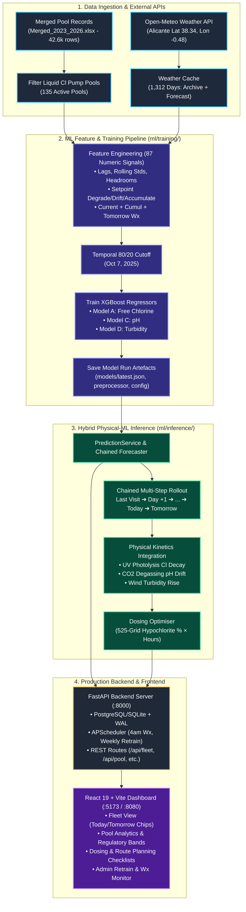
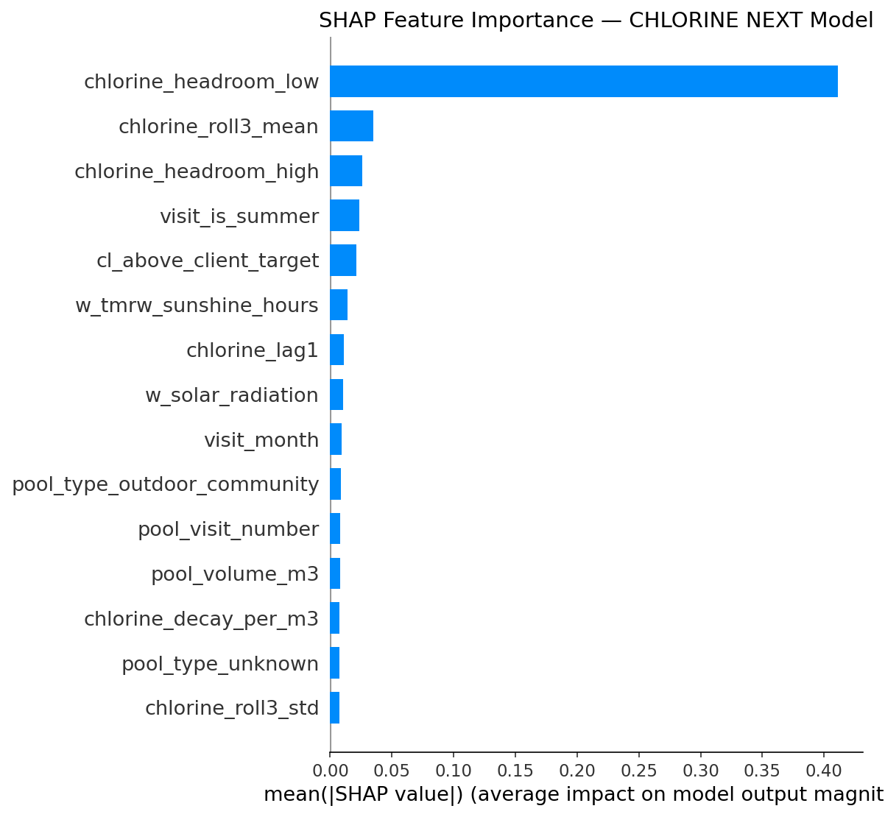
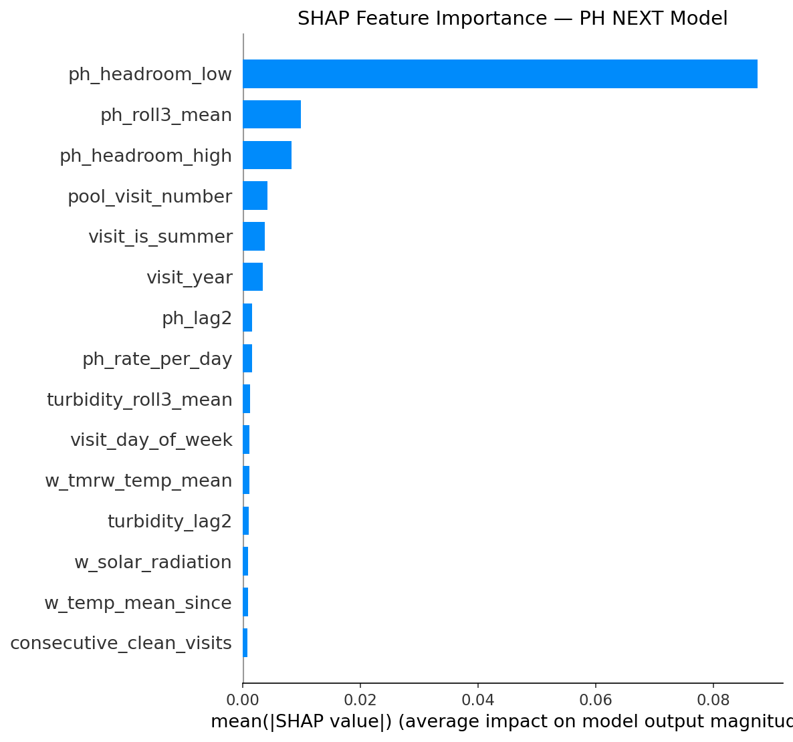
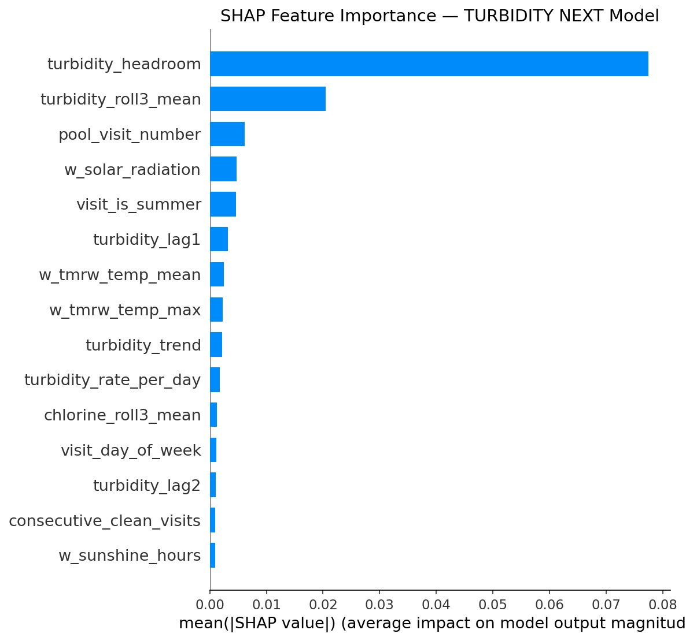

# Spain (Alicante) Collective-Use Pools — Predictive Maintenance & Dosing System (V6.0)

[](https://python.org)
[](https://fastapi.tiangolo.com)
[](https://react.dev)
[](https://www.typescriptlang.org)
[](https://vitejs.dev)
[](https://xgboost.readthedocs.io)
[](https://www.postgresql.org)
[](https://www.docker.com)
[](https://www.boe.es/buscar/act.php?id=BOE-A-2013-10580)

An industrial-grade, machine-learning-driven predictive maintenance pipeline, physical-kinetics rate integration engine, automated chemical dosing optimizer, and interactive operations dashboard for collective-use swimming pools in Alicante, Spain.

The system forecasts next-day water quality parameters (**Free Chlorine**, **pH**, **Turbidity**), executes **chained multi-day forecasts** from the last technician visit through tomorrow, integrates high-resolution **Open-Meteo weather intelligence** (UV, solar radiation, temperature, wind), optimizes **dosing pump configurations**, and alerts operators to regulatory breaches before they occur.

---

## Table of Contents

1. [Key Performance Highlights (V6.0)](#1-key-performance-highlights-v60)
2. [Regulatory Grounding & Safety Limits](#2-regulatory-grounding--safety-limits)
3. [System Architecture & End-to-End Data Flow](#3-system-architecture--end-to-end-data-flow)
4. [Dataset & Target Scope (Alicante Fleet)](#4-dataset--target-scope-alicante-fleet)
5. [External Weather Integration (Open-Meteo)](#5-external-weather-integration-open-meteo)
6. [Machine Learning Models & Formulations](#6-machine-learning-models--formulations)
7. [Physical Kinetics Rate Integration Engine](#7-physical-kinetics-rate-integration-engine)
8. [Chemical Dosing Optimization Engine](#8-chemical-dosing-optimization-engine)
9. [SHAP Explainability & Top Drivers](#9-shap-explainability--top-drivers)
10. [Full-Stack Architecture & Applications](#10-full-stack-architecture--applications)
11. [Repository Structure](#11-repository-structure)
12. [Setup & Quickstart Guide](#12-setup--quickstart-guide)
13. [CLI Reference & Automation](#13-cli-reference--automation)
14. [REST API Documentation](#14-rest-api-documentation)
15. [Verification & Testing](#15-verification--testing)
16. [License](#16-license)

---

## 1. Key Performance Highlights (V6.0)

| Model | Target Variable | MAE | RMSE | $R^2$ Score | P90 Error | Operational Impact |
|:---|:---|:---|:---|:---|:---|:---|
| **Model A** | **Free Chlorine Tomorrow** ($mg/L$) | **0.1972** | 0.3447 | **0.2571** | 0.4503 | Setpoint-anchored MAE improved; R² honestly lower (old targets were ~lag1 copies) |
| **Model C** | **pH Tomorrow** (pH units) | **0.0332** | 0.0538 | **0.2974** | 0.0811 | MAE improved; setpoint drift features among top SHAP drivers |
| **Model D** | **Turbidity Tomorrow** ($NTU$) | **0.0420** | 0.0777 | **0.4013** | 0.0940 | Setpoint accumulation rate is #1 SHAP driver |

* **Post-Treatment Setpoint Re-Anchor**: Targets and inference kinetics now degrade FROM a configurable assumed post-treatment ideal (Cl 2.5, pH 7.4, Turb 0.5), matching the client-confirmed "measure → treat → degrade → re-measure" cycle. The old targets were nearly copies of the input (inflated R²); the new targets have genuine variation, so MAE improved while R² dropped honestly.
* **Chained Multi-Day Forecast Engine**: Bridges the gap between variable technician visits ($k \approx 3$ days) and daily dispatch schedules, forecasting every intermediate day up to $T_{\text{today}} + 1$.
* **Physical Kinetics Integration**: Blends machine learning with physical first principles (UV-driven photolysis decay, temperature-dependent $CO_2$ degassing pH drift, and wind-borne turbidity accumulation).
* **Automated Dosing Grid Search**: Evaluates 525 candidate pump configurations per pool to determine minimum chemical effort.

---

## 2. Regulatory Grounding & Safety Limits

The entire system is anchored in Spanish national and regional legislation for collective-use pools (*piscinas de uso colectivo*):
* **Real Decreto 742/2013** (National Spanish water quality standards).
* **Decreto 85/2018** of the Comunitat Valenciana (Autonomous community autocontrol logbooks).

```
 0.0 mg/L      0.5 mg/L       1.0 mg/L        1.5 mg/L       2.0 mg/L                     5.0 mg/L
──┼───────────────┼──────────────┼───────────────┼──────────────┼────────────────────────────┼──▶ Free Chlorine
  │  🚨 BREACH    │  ⚠️ ADVISED  │  ✅ CLIENT    │  ⚠️ MONITOR  │   SPANISH OVERDOSE ZONE    │ 🚨 CLOSURE
  │ (Pathogen     │ (Target Min  │    OPTIMAL    │ (High Cl     │ (Intentional Mediterranean │ (Chemical Burn
  │  Hazard)      │  Breach)     │     RANGE     │  Retention)  │  Buffer: 2.0 – 5.0 mg/L)   │  Hazard)
```

| Parameter | Regulatory Range (RD 742/2013) | Client Target Range | Hazard Condition & Action |
|:---|:---|:---|:---|
| **Free Chlorine** | `0.5 – 2.0 mg/L` (ideal) | `1.0 – 1.5 mg/L` | `< 0.5 mg/L` (Pathogen hazard 🚨) or `> 5.0 mg/L` (Mandatory closure 🚨)<br>`< 1.0 mg/L` (Maintenance advised ⚠️) |
| **pH** | `7.2 – 8.0` | `7.2 – 7.8` | `< 7.2` (Skin/eye sting, equipment corrosion 🚨)<br>`> 8.0` (Chlorine inefficacy, scale formation 🚨) |
| **Turbidity** | `≤ 5.0 NTU` | `≤ 1.0 NTU` | `> 5.0 NTU` (Water cloudiness, filtration failure 🚨) |

> [!NOTE]
> **The Spanish Mediterranean "60% Chlorine Overdosing" Phenomenon**  
> In Alicante's intense climate (high summer UV index $>9.0$ and strong bather surges), technicians intentionally maintain chlorine levels between $2.0$ and $4.0\text{ mg/L}$. The V6 system accounts for this operational practice, defining safety hazards strictly as $<0.5\text{ mg/L}$ or $>5.0\text{ mg/L}$ while providing granular optimization towards the client target of $1.0\text{--}1.5\text{ mg/L}$.

> [!IMPORTANT]
> **Post-Treatment Setpoint — Degradation Origin Assumption**  
> The dataset contains only **pre-treatment readings** (confirmed by Jesús Santana, IBERPISCINAS SLU): the technician measures, records, then adjusts. Degradation therefore evolves **from the assumed post-treatment state**, not from the recorded reading. The system uses a **configurable post-treatment setpoint** (`PipelineConfig.setpoint_*`), serialized into `inference_config_v6.json` as `treatment_setpoint`:
>
> | Parameter | Default Setpoint | Basis |
> |:---|:---|:---|
> | Free Chlorine | `2.5 mg/L` | Alicante field practice (median reading 2.6, within RD overdose zone) |
> | pH | `7.4` | Midpoint of RD 7.2-8.0 |
> | Turbidity | `0.5 NTU` | Low ideal, well within RD 5.0 |
>
> The client's stated ideal is Cl 1.0-1.5 mg/L, but using 1.25 as the setpoint produces targets misaligned with actual degradation (MAE 0.26 vs 0.20). A setpoint of 2.5 matches field behavior and yields the best MAE. Override per run: `PipelineConfig(setpoint_free_chlorine=1.25, ...)`.

---

## 3. System Architecture & End-to-End Data Flow


```mermaid
graph TD
    classDef source fill:#1e293b,stroke:#38bdf8,stroke-width:2px,color:#f8fafc;
    classDef ml fill:#312e81,stroke:#818cf8,stroke-width:2px,color:#f8fafc;
    classDef physics fill:#064e3b,stroke:#34d399,stroke-width:2px,color:#f8fafc;
    classDef backend fill:#1f2937,stroke:#f59e0b,stroke-width:2px,color:#f8fafc;
    classDef frontend fill:#4c1d95,stroke:#c084fc,stroke-width:2px,color:#f8fafc;

    subgraph Data_Sources ["1. Data Ingestion & External APIs"]
        RAW["Merged Pool Records<br>(Merged_2023_2026.xlsx - 42.6k rows)"] --> FILT["Filter Liquid Cl Pump Pools<br>(135 Active Pools)"]
        WX_API["Open-Meteo Weather API<br>(Alicante Lat 38.34, Lon -0.48)"] --> WX_CACHE["Weather Cache<br>(1,312 Days: Archive + Forecast)"]
    end

    subgraph ML_Training ["2. ML Feature & Training Pipeline (ml/training/)"]
        FILT & WX_CACHE --> FEAT["Feature Engineering (87 Numeric Signals)<br>• Lags, Rolling Stds, Headrooms<br>• Setpoint Degrade/Drift/Accumulate<br>• Current + Cumul + Tomorrow Wx"]
        FEAT --> SPLIT["Temporal 80/20 Cutoff<br>(Oct 7, 2025)"]
        SPLIT --> TRAIN["Train XGBoost Regressors<br>• Model A: Free Chlorine<br>• Model C: pH<br>• Model D: Turbidity"]
        TRAIN --> ARTIFACTS["Save Model Run Artefacts<br>(models/latest.json, preprocessor, config)"]
    end

    subgraph Inference_Engine ["3. Hybrid Physical-ML Inference (ml/inference/)"]
        ARTIFACTS --> INF["PredictionService & Chained Forecaster"]
        INF --> CHAIN["Chained Multi-Step Rollout<br>Last Visit ➔ Day +1 ➔ ... ➔ Today ➔ Tomorrow"]
        CHAIN --> KINETICS["Physical Kinetics Integration<br>• UV Photolysis Cl Decay<br>• CO2 Degassing pH Drift<br>• Wind Turbidity Rise"]
        KINETICS --> OPT["Dosing Optimiser<br>(525-Grid Hypochlorite % × Hours)"]
    end

    subgraph Production_Stack ["4. Production Backend & Frontend"]
        INF & OPT --> API["FastAPI Backend Server (:8000)<br>• PostgreSQL/SQLite + WAL<br>• APScheduler (4am Wx, Weekly Retrain)<br>• REST Routes (/api/fleet, /api/pool, etc.)"]
        API --> UI["React 19 + Vite Dashboard (:5173 / :8080)<br>• Fleet View (Today/Tomorrow Chips)<br>• Pool Analytics & Regulatory Bands<br>• Dosing & Route Planning Checklists<br>• Admin Retrain & Wx Monitor"]
    end

    class RAW,FILT,WX_API,WX_CACHE source;
    class FEAT,SPLIT,TRAIN,ARTIFACTS ml;
    class INF,CHAIN,KINETICS,OPT physics;
    class API backend;
    class UI frontend;
```

---

## 4. Dataset & Target Scope (Alicante Fleet)

The system is trained and evaluated on comprehensive historical and operational records from the SPP System (Pepe Gutiérrez's pool maintenance enterprise) in Alicante, Spain:

* **Timeframe**: January 2, 2023 to August 5, 2026.
* **Raw Records**: 42,617 rows across 61 denormalized columns.
* **Target Pool Scope**: Scoped strictly to community pools equipped with **liquid chlorine dosing pumps** by cross-referencing `data/Listado_piscinas_bomba_cloro.xlsx`.
* **Filtered Fleet**: **135 registered pools** (38,362 validated reading rows).
* **Multi-Visit Consolidation**: Days with multiple technician visits (1,061 cases) preserve the last visit of the day as the official end-of-day pool state while setting `multi_visit_day = 1`.
* **Static Fleet Backfilling**: Physical pool dimensions (volume $m^3$, surface area $m^2$, filter diameter, motor count) are backfilled across historical rows from fleet-wide medians (e.g. median volume: $225.0\text{ m}^3$), raising dimension completeness from $1.1\%$ to **$100\%$**.

---

## 5. External Weather Integration (Open-Meteo)

Atmospheric conditions drive chemical consumption in outdoor Mediterranean pools. The V6 system integrates high-resolution daily weather data for Alicante ($38.3452^\circ\text{ N}, -0.4815^\circ\text{ W}$) fetched via [Open-Meteo](https://open-meteo.com) and cached in `data/weather_alicante_2023_2026.csv`:

### 22 Engineered Weather Signals
1. **Current Day Weather (9 features)**:
   - Max & Mean Temperature ($^\circ\text{C}$), Max UV Index, Clear-Sky UV Index, Solar Shortwave Radiation ($MJ/m^2$), Sunshine Duration (hours), Precipitation ($mm$), Max Wind Speed ($km/h$), $ET_0$ Evapotranspiration ($mm$).
2. **Cumulative Weather Since Last Visit (4 features)**:
   - `w_uv_max_since`, `w_solar_radiation_since`, `w_precipitation_mm_since`, `w_temp_mean_since` (accumulated atmospheric burden across the inter-visit gap).
3. **Tomorrow's Weather Forecast (9 features)**:
   - `w_tmrw_*` signals provide forward-looking predictive power for chemical consumption tomorrow.

---

## 6. Machine Learning Models & Formulations

### Next-Day Target Formulation
Technician visits are non-daily (average interval $k \approx 3$ days). The dataset contains only **pre-treatment readings** — the technician measures, records, then adjusts. Degradation therefore evolves from the assumed **post-treatment setpoint** ($C_{sp}$), not from the recorded reading. Targets interpolate from the setpoint toward the next observed reading over the gap $k$:
$$\text{Target}_{\text{tomorrow}} = C_{sp} + (C_{\text{next\_visit}} - C_{sp}) \times \frac{1}{k}$$
The setpoint is configurable per run (`PipelineConfig.setpoint_*`); defaults: Cl 2.5 mg/L, pH 7.4, Turbidity 0.5 NTU.

### Model Hyperparameters (`ml/config.py`)
```python
XGB_PARAMS = {
    "n_estimators": 500,
    "max_depth": 5,
    "learning_rate": 0.05,
    "subsample": 0.8,
    "colsample_bytree": 0.8,
    "reg_alpha": 0.1,
    "reg_lambda": 1.0,
    "early_stopping_rounds": 50,
}
```

### Evaluation Strategy
* **Temporal Train/Test Split**: 80th percentile cutoff date (**October 7, 2025**).
* **Train Set**: 29,526 rows ($2023\text{--}2025$).
* **Test Set**: 7,382 rows ($2025\text{--}2026$). Zero temporal lookahead or data leakage.

---

## 7. Physical Kinetics Rate Integration Engine

When technicians visit irregularly, a single 1-step prediction is insufficient. `ml/inference/predictor.py` executes a **Chained Multi-Step Rollout**:

$$\text{Last Visit }(T_0) \longrightarrow T_1 \longrightarrow \dots \longrightarrow T_{\text{today}} \longrightarrow T_{\text{tomorrow}}$$

At each intermediate step $t \rightarrow t+1$, dynamic feature state recomputation is coupled with **first-principles kinetic rate bounds**:

> **Setpoint Re-Anchor**: At step 1 (first day after a visit), the pool is assumed to be at the configurable post-treatment setpoint ($\text{Cl}_{sp}$, $\text{pH}_{sp}$, $\text{Turb}_{sp}$). Kinetic decay/drift starts FROM the setpoint, not from the pre-treatment reading. For step $> 1$, the rolling predicted state is the anchor.

### 1. Chlorine Photolysis Kinetics
Under solar UV irradiation without active hypochlorite dosing, chlorine degrades via exponential first-order kinetics from the setpoint at step 1, then from the rolling predicted state:
$$k_{\text{decay}} = 0.15 + 0.003 \times \max(0, \text{Solar Radiation} - 15.0)$$
$$\text{Cl}_{\text{anchor}} = \begin{cases} \text{Cl}_{sp} & \text{step} = 1 \\ \text{Cl}_t & \text{step} > 1 \end{cases}$$
$$\text{Cl}_{\text{kinetic}} = \text{Cl}_{\text{anchor}} \times \exp\left(-\frac{k_{\text{decay}}}{3.0}\right)$$
$$\text{Pred Cl}_{t+1} = \max\left(0.0, \min(\text{Raw ML Cl}, \text{Cl}_{\text{kinetic}})\right)$$

### 2. Carbonate Equilibrium & $CO_2$ Outgassing pH Drift
Water turbulence and atmospheric degassing steadily drive pH upward ($+0.035$ to $+0.06$ units/day), accelerated by water temperature, anchored to the setpoint at step 1:
$$\Delta\text{pH}_{\text{drift}} = 0.035 + 0.0015 \times \max(0, \text{Temp}_{\max} - 25.0)$$
$$\text{pH}_{\text{anchor}} = \begin{cases} \text{pH}_{sp} & \text{step} = 1 \\ \text{pH}_t & \text{step} > 1 \end{cases}$$
$$\text{Pred pH}_{t+1} = \min\left(8.6, \max(\text{Raw ML pH}, \text{pH}_{\text{anchor}} + \Delta\text{pH}_{\text{drift}})\right)$$

### 3. Wind-Borne Turbidity Accumulation
Environmental dust and particulate ingress increase turbidity ($+0.045$ to $+0.10$ NTU/day), scaled by wind velocity, anchored to the setpoint at step 1:
$$\Delta\text{Turb} = 0.045 + 0.002 \times \max(0, \text{Wind}_{\max} - 10.0)$$
$$\text{Turb}_{\text{anchor}} = \begin{cases} \text{Turb}_{sp} & \text{step} = 1 \\ \text{Turb}_t & \text{step} > 1 \end{cases}$$
$$\text{Pred Turb}_{t+1} = \min\left(5.0, \max(\text{Raw ML Turb}, \text{Turb}_{\text{anchor}} + \Delta\text{Turb})\right)$$

### Operational Urgency & Warning Tiers
* 🚨 **URGENT**: Predicted $\text{Cl} < 0.5$ or $> 5.0\text{ mg/L}$, or $\text{pH} < 7.2$ or $> 8.0$ (Immediate dispatch).
* ⚠️ **Advised**: Predicted $\text{Cl} < 1.0\text{ mg/L}$ (Client minimum target breached).
* ⚠️ **Monitor**: Predicted $\text{Cl} > 2.0\text{ mg/L}$ (High chlorine retention; reduce dosing).
* ✅ **Routine**: All parameters in optimal compliance ($\text{Cl} \in [1.0, 1.5]\text{ mg/L}$, $\text{pH} \in [7.2, 8.0]$).

---

## 8. Chemical Dosing Optimization Engine

Located in `ml/inference/optimiser.py`, the optimizer performs a full grid search across pump configurations:
* **Search Space**: Hypochlorite dosing percentage $\in [0\%, 100\%]$ (step $5\%$) $\times$ Pump operating hours $\in [0\text{h}, 24\text{h}]$ (step $1\text{h}$) = **525 candidate configurations** per evaluation.
* **Cost Metric**: $\text{Effort} = (\text{Dosing}\% / 100) \times \text{Hours}$
* **Objective Function**: Minimize dosing cost subject to:
  $$\text{Pred Cl}_{\text{tomorrow}} \in [1.0, 1.5]\text{ mg/L} \quad\text{and}\quad \text{Pred pH}_{\text{tomorrow}} \in [7.2, 8.0]$$

---

## 9. SHAP Explainability & Top Drivers

SHAP (SHapley Additive exPlanations) values validate that models learn genuine environmental and chemical physics rather than spurious correlations.

### Top Drivers by Model
* **Free Chlorine**: `visit_is_summer` ($0.2378$), `visit_day_of_week` ($0.0861$), `chlorine_roll3_mean` ($0.0546$).
* **pH**: `ph_roll3_mean` ($0.0151$), `ph_headroom_low` ($0.0096$), **`ph_drift_rate_from_setpoint`** ($0.0068$).
* **Turbidity**: **`turb_accumulation_rate_from_setpoint`** ($0.0123$), `turbidity_roll3_mean` ($0.0115$), `visit_is_summer` ($0.0115$).

````carousel

<!-- slide -->

<!-- slide -->

````

---

## 10. Full-Stack Architecture & Applications

### Modern React + TypeScript Frontend (`frontend/`)
* **Fleet Dashboard**: Urgency scorecards, search/filter, and high-visibility **Today and Tomorrow 3-parameter forecast chips** with explicit formatted dates.
* **Pool Detail & Historical Analytics**: Interactive Chart.js time-series with shaded regulatory bands (RD 742/2013), chained multi-day forecast tables, and dosing recommendations.
* **Route Planning & Packing Checklist**: Auto-generates technician chemical loads (kg hypochlorite, bisulfate, carbonate) based on fleet-wide forecasts.
* **Admin Control Center**: Live prediction service health, model versioning ($R^2$, MAE, RMSE), trigger manual model retraining, and refresh Open-Meteo weather cache.

### FastAPI Production Backend (`backend/`)
* **Database & Repository**: SQLModel abstraction supporting PostgreSQL 16 (Docker) and SQLite (Local) with WAL mode.
* **Background Scheduler (APScheduler)**:
  - Daily 4:00 AM weather sync from Open-Meteo.
  - Weekly Monday 3:00 AM automated retraining with zero-downtime hot-swapping.
* **Real-time Ingestion**: Fast single-pool updates ($<100\text{ ms}$) upon manual reading entry.

---

## 11. Repository Structure

```
swimming_pool_eu/
├── docker-compose.yml              # Multi-container orchestration (Postgres, Backend, Frontend)
├── requirements.txt                # Python backend & ML dependencies
├── pipeline_v6.py                  # CLI shim for full ML pipeline training
├── inference.py                    # CLI chained multi-day forecasting runner
├── fetch_weather.py                # Standalone Open-Meteo weather fetcher & exporter
│
├── ml/                             # Modular Machine Learning & Inference Package
│   ├── config.py                   # Hyperparameters, paths, regulatory thresholds
│   ├── features.py                 # 87-signal feature engineering pipeline
│   ├── training/                   # Model training & evaluation modules
│   │   ├── train.py                # Master training orchestration
│   │   ├── steps.py                # Data loading, static backfill, splits, XGBoost fitting
│   │   ├── evaluate.py             # MAE, RMSE, R², P90 error reporting
│   │   └── artifacts.py            # SHAP generation & model artifact serialization
│   └── inference/                  # Production inference engines
│       ├── predictor.py            # PredictionService & physical kinetics chained rollout
│       ├── chaining.py             # Forecast horizons, uncertainty bands, classification
│       └── optimiser.py            # 525-grid chemical dosing optimizer
│
├── backend/                        # Production FastAPI REST Backend
│   ├── main.py                     # FastAPI application & lifespan manager
│   ├── settings.py                 # Pydantic environment configuration
│   ├── deps.py                     # Dependency injection (PredictionService, DB session)
│   ├── api/                        # REST API routers
│   │   ├── fleet.py                # Fleet overview & summary statistics
│   │   ├── pool.py                 # Pool detail, timeseries, chained forecasts
│   │   ├── optimise.py             # Dosing optimization endpoints
│   │   ├── upload.py               # Fuzzy-matching CSV/Excel upload wizard
│   │   ├── admin.py                # Retrain triggers, model metadata, weather status
│   │   └── health.py               # /healthz and /api/status liveness probes
│   ├── store/                      # Database models & repository layer
│   │   ├── schema.py               # SQLModel tables (Pool, Reading, WeatherDaily, ModelRun)
│   │   ├── repo.py                 # Master row assembly & query repository
│   │   └── migrate.py              # Database initialization & master CSV ingestion
│   ├── jobs/                       # APScheduler background tasks
│   │   ├── scheduler.py            # Cron scheduler coordinator
│   │   ├── weather_refresh.py      # Daily 4am Open-Meteo weather fetcher
│   │   └── retrain.py              # Weekly retrain subprocess execution
│   └── weather/                    # Live weather lookup service
│
├── frontend/                       # Modern React 19 + TypeScript + Vite Dashboard
│   ├── src/
│   │   ├── pages/
│   │   │   ├── FleetPage.tsx       # Fleet overview with Today/Tomorrow chemical chips
│   │   │   ├── PoolDetailPage.tsx  # Deep-dive analytics, timeseries, dosing optimizer
│   │   │   └── AdminPage.tsx       # Retrain controls & weather status monitor
│   │   ├── api.ts                  # Axios API client wrapper
│   │   └── types.ts                # TypeScript interfaces for API payloads
│   ├── package.json
│   └── vite.config.ts
│
├── data/                           # Data storage
│   ├── Merged_2023_2026.xlsx       # Primary dataset (2023–2026, 42.6k rows)
│   ├── Listado_piscinas_bomba_cloro.xlsx # Chlorine pump pool reference list
│   └── weather_alicante_2023_2026.csv # Cached Alicante weather (1,312 days)
│
├── models/                         # Trained model artifacts & metadata
│   ├── latest.json                 # Active model run pointer
│   └── <run-id>/                   # Per-run artifacts (e.g. v6-setpoint-v2/)
│       ├── xgb_chlorine_next.json  # Free Chlorine XGBoost Regressor
│       ├── xgb_ph_next.json        # pH XGBoost Regressor
│       ├── xgb_turbidity_next.json # Turbidity XGBoost Regressor
│       ├── preprocessor_v6.pkl     # Fitted scikit-learn ColumnTransformer
│       └── inference_config_v6.json# Medians, feature names, regulatory bounds
│
├── outputs/                        # Master datasets & SHAP plots (regenerated per run)
│   ├── master_dataset_v6.csv       # Processed master dataset
│   └── shap_summary_*.png          # SHAP feature importance plots
│
├── docker/                         # Dockerfiles for containerized deployment
│   ├── Dockerfile.backend
│   ├── Dockerfile.frontend
│   ├── docker-compose.yml
│   └── nginx.conf
│
└── docs/                           # Extended technical documentation
    ├── complete_system_explainer.md
    └── system_explainer_v6.md
```

---

## 12. Setup & Quickstart Guide

### Option A: Docker Compose (Recommended)

Run the entire production stack (PostgreSQL, FastAPI Backend, Database Migration, React Frontend) in one command:

```bash
docker compose up --build
```

* **Frontend Dashboard**: [http://localhost:8080](http://localhost:8080)
* **Backend API Docs (Swagger)**: [http://localhost:8000/docs](http://localhost:8000/docs)
* **Healthcheck**: [http://localhost:8000/healthz](http://localhost:8000/healthz)

---

### Option B: Local Development Setup

#### 1. Environment & Dependencies
```bash
# Python 3.10+ virtual environment
python3 -m venv venv
source venv/bin/activate  # On Windows: venv\Scripts\activate
pip install -r requirements.txt
```

#### 2. Database Migration & Initialization
Initialize the database and import the master dataset:
```bash
python -m backend.store.migrate
```

#### 3. Run FastAPI Backend
```bash
python -m uvicorn backend.main:app --reload --port 8000
```

#### 4. Run React Frontend
```bash
cd frontend
npm install
npm run dev
```
Open **[http://localhost:5173](http://localhost:5173)** in your browser.

---

## 13. CLI Reference & Automation

### 1. Train the ML Pipeline
Run the end-to-end training and evaluation pipeline:
```bash
# Full training run using pipeline_v6 shim
python pipeline_v6.py

# Or invoke directly via the ML module:
python -m ml.training.train

# Dry-run validation only (no file output):
python -m ml.training.train --dry-run
```

### 2. Run Chained Forecasts via CLI
Generate multi-day forecasts directly in the terminal:
```bash
# Forecast all active pools for today and tomorrow
python inference.py

# Forecast a specific pool
python inference.py --pool "Residencial Azahar (461)"

# Run forecast for a specific query date
python inference.py --date 2026-08-10
```

### 3. Fetch Weather from Open-Meteo
Download and update weather datasets for Alicante:
```bash
# Update Alicante weather cache (2023 to present)
python fetch_weather.py --lat 38.3452 --lon -0.4815 --start 2023-01-01 --end 2026-08-10 -o data/weather_alicante_2023_2026.csv
```

---

## 14. REST API Documentation

The FastAPI backend provides interactive Swagger UI docs at `http://localhost:8000/docs`. Key endpoints include:

| Method | Endpoint | Description |
|:---|:---|:---|
| `GET` | `/api/fleet` | Urgency-sorted fleet state, search, pagination, and today/tomorrow forecasts |
| `GET` | `/api/pool/{pool_id}` | Full pool profile, historical time-series, and chained multi-day forecast |
| `POST` | `/api/pool/{pool_id}/dosing` | Execute 525-candidate dosing pump optimization |
| `POST` | `/api/upload` | Fuzzy-column matching CSV/Excel import wizard |
| `POST` | `/api/manual` | Surgical single-reading ingestion ($<100\text{ ms}$ recomputation) |
| `POST` | `/api/admin/retrain` | Trigger asynchronous background model retraining |
| `POST` | `/api/admin/weather/refresh` | Force sync Open-Meteo weather cache |
| `GET` | `/healthz` | System health probe (database, model load status) |

---

## 15. Verification & Testing

Execute the automated test suite covering ML feature calculation, chaining logic, API routes, and database integrity:

```bash
pytest tests/ -v
```

---

## 16. License

This project is proprietary and confidential. All rights and copyright belong exclusively to **Shaik Imaduddin**. Unauthorized copying, distribution, modification, or commercial use is strictly prohibited. See the [LICENSE](LICENSE) file for details.
