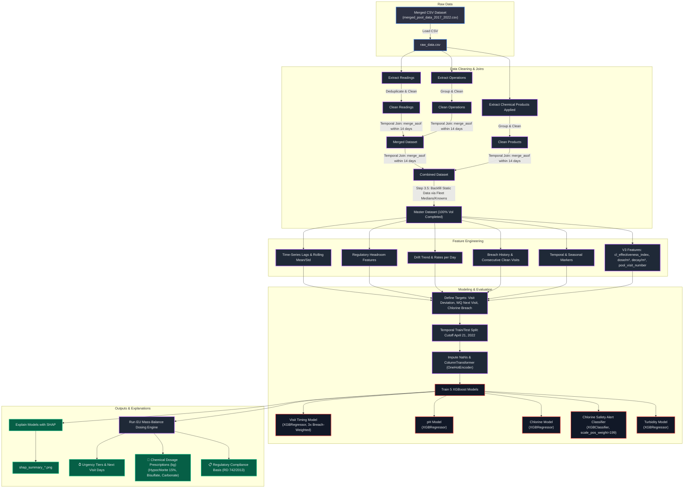

# Spain (Alicante) Collective-Use Pools — Predictive Maintenance & Dosing System (V3)

A machine-learning-driven predictive maintenance pipeline and interactive dashboard for collective-use swimming pools in Alicante, Spain. The system uses **XGBoost** models to forecast water quality parameters (pH, free chlorine, turbidity), predict **when the next technician visit should occur**, alert on potential **chlorine safety breaches**, and prescribe **precise chemical dosages** (in kilograms) for the technician to bring to the site.

The system is fully grounded in Spanish national and regional pool health regulations:
* **Real Decreto 742/2013** (National Spanish water quality standards for collective-use pools).
* **Decreto 85/2018** of the Comunitat Valenciana (Regional adaptation requiring daily autocontrol logbooks).

---

## 1. System Architecture & Data Flows

### A. End-to-End Model Training Pipeline (`pipeline_v3.py`)
The training pipeline processes raw historical CSV logs, performs static feature backfilling, engineers advanced features, trains 5 XGBoost models, and generates SHAP explainability analyses.


```mermaid
graph TD
    %% Define styles
    classDef data fill:#2d3142,stroke:#4f8ff7,stroke-width:2px,color:#e8eaed;
    classDef process fill:#1f2937,stroke:#a855f7,stroke-width:2px,color:#e8eaed;
    classDef model fill:#111827,stroke:#ef4444,stroke-width:2px,color:#e8eaed;
    classDef output fill:#065f46,stroke:#10b981,stroke-width:2px,color:#e8eaed;

    subgraph Raw Data
        A["Merged CSV Dataset<br>(merged_pool_data_2017_2022.csv)"] -->|Load CSV| B["raw_data.csv"]
    end
    
    subgraph Data Cleaning & Joins
        B --> C["Extract Readings"]
        B --> D["Extract Operations"]
        B --> E["Extract Chemical Products Applied"]
        C -->|Deduplicate & Clean| F["Clean Readings"]
        D -->|Group & Clean| G["Clean Operations"]
        E -->|Group & Clean| H["Clean Products"]
        F & G -->|Temporal Join: merge_asof within 14 days| I["Merged Dataset"]
        I & H -->|Temporal Join: merge_asof within 14 days| J["Combined Dataset"]
        J -->|Step 3.5: Backfill Static Data via Fleet Medians/Knowns| K["Master Dataset (100% Vol Completed)"]
    end
    
    subgraph Feature Engineering
        K --> L["Time-Series Lags & Rolling Mean/Std"]
        K --> M["Regulatory Headroom Features"]
        K --> N["Drift Trend & Rates per Day"]
        K --> O["Breach History & Consecutive Clean Visits"]
        K --> P["Temporal & Seasonal Markers"]
        K --> Q["V3 Features: cl_effectiveness_index, dose/m³, decay/m³, pool_visit_number"]
    end
    
    subgraph Modeling & Evaluation
        L & M & N & O & P & Q --> R["Define Targets: Visit Deviation, WQ Next Visit, Chlorine Breach"]
        R --> S["Temporal Train/Test Split: Cutoff April 21, 2022"]
        S --> T["Impute NaNs & ColumnTransformer (OneHotEncoder)"]
        T --> U["Train 5 XGBoost Models"]
        U --> U1["Visit Timing Model<br>(XGBRegressor, 3x Breach-Weighted)"]
        U --> U2["pH Model<br>(XGBRegressor)"]
        U --> U3["Chlorine Model<br>(XGBRegressor)"]
        U --> U4["Chlorine Safety Alert Classifier<br>(XGBClassifier, scale_pos_weight=199)"]
        U --> U5["Turbidity Model<br>(XGBRegressor)"]
    end
    
    subgraph Outputs & Explanations
        U --> V["Explain Models with SHAP"]
        V --> V1["shap_summary_*.png"]
        U --> W["Run EU Mass-Balance Dosing Engine"]
        W --> W1["⏱ Urgency Tiers & Next Visit Days"]
        W --> W2["💊 Chemical Dosage Prescriptions (kg)<br>(Hypochlorite 15%, Bisulfate, Carbonate)"]
        W --> W3["📋 Regulatory Compliance Basis (RD 742/2013)"]
    end

    class A,B data;
    class C,D,E,F,G,H,I,J,K,L,M,N,O,P,Q,R,S,T,W process;
    class U,U1,U2,U3,U4,U5 model;
    class V,V1,W1,W2,W3 output;
```

---

### B. Interactive Prototype UI Dashboard (`prototype_ui/app.py`)
The dashboard serves a single-page web application featuring live ML predictions, rule-based fallback, custom data uploading (CSV/Excel), and manual data entry.

```mermaid
graph TD
    classDef ui fill:#1e1b4b,stroke:#818cf8,stroke-width:2px,color:#e8eaed;
    classDef server fill:#1e293b,stroke:#38bdf8,stroke-width:2px,color:#e8eaed;
    classDef model fill:#0f172a,stroke:#f43f5e,stroke-width:2px,color:#e8eaed;
    classDef storage fill:#14532d,stroke:#22c55e,stroke-width:2px,color:#e8eaed;

    subgraph Client UI (Vanilla HTML/CSS/JS + Chart.js)
        UI_Home["Fleet Overview Dashboard<br>(Urgency Cards & Searchable Table)"]
        UI_Modal["Pool Detail Modal<br>(Time-Series Charts with Shaded Bands)"]
        UI_Upload["CSV/Excel Upload Wizard<br>(Fuzzy Column Mapping Preview)"]
        UI_Manual["Manual Reading Form<br>(Real-time validation & Autocomplete)"]
    end

    subgraph Flask Backend Server (app.py)
        API["REST API Endpoints<br>(/api/fleet, /api/pool, /api/upload, etc.)"]
        DS["In-Memory DataStore<br>(Demo Snapshot & Restoration State)"]
        FE["Feature Pipeline Integration<br>(feature_pipeline.py - build_features)"]
        INF["ML Inference Coordinator"]
    end

    subgraph Model Storage (models/)
        CFG["inference_config.json<br>(Fleet Medians, Numeric/Categorical schemas)"]
        PRE["preprocessor.pkl<br>(scikit-learn ColumnTransformer)"]
        M_WQ["Water Quality Models<br>(XGBoost pH, Cl, Turbidity)"]
        M_CLF["Chlorine Safety Classifier<br>(XGBoost Breach Classifier)"]
    end

    %% Client and Server interaction
    UI_Home -->|Fetch Fleet State| API
    UI_Modal -->|Request Pool Profile| API
    UI_Upload -->|Post CSV/XLSX File| API
    UI_Manual -->|Submit Manual Reading| API

    %% Backend processing flow
    API --> DS
    DS -->|Query Pool History| INF
    INF --> FE
    FE -->|Transform to Features| PRE
    PRE -->|Preprocessed Vector X| M_WQ & M_CLF
    CFG -->|Medians & Fill Values| FE
    M_WQ & M_CLF -->|Return Predictions & Probability| INF
    INF -->|Compute Hybrid Scheduling & Dosages| API
    API -->|JSON Response| UI_Home & UI_Modal

    %% Fast insertion flow
    UI_Manual -->|Surgical Insert| DS
    DS -->|Single-Pool Update < 100ms| INF

    class UI_Home,UI_Modal,UI_Upload,UI_Manual ui;
    class API,DS,FE,INF server;
    class CFG,PRE,M_WQ,M_CLF model;
```

---

## 2. Raw Data Characteristics & Quality

The system is built using records provided by the **SPP System** (Pepe Gutiérrez's pool maintenance company) located in Alicante, Spain.

* **Dataset Size**: 138,660 rows after merging (historical records from April 25, 2017, to December 30, 2022).
* **Pools Count**: 476 unique physical pools.
* **Temporal Coverage**: 2017 to 2022.
* **Structure**: The raw table is highly denormalized, containing three tables written side-by-side in each row:
  1. **Water Quality Readings**: pH, free chlorine, turbidity, pool surface/volume dimensions, deck details, and date/time.
  2. **Operations**: Filtration hours, water temperature, dosing pump flow settings.
  3. **Chemical Products Applied**: Hand-applied chemical products (liquids, tablets, sticks, granular) by the technician on that day.

> [!IMPORTANT]
> **Static Pool Dimensions Backfill (V3 Improvement)**
> In the raw spreadsheet, static dimensions like pool volume, surface area, filter diameter, and motor count are missing in >98% of the rows (originally, only 1.4% of readings had volume recorded). 
> 
> To enable precise dosing and volume-normalized machine learning, **Step 3.5** propagates each pool's known static variables to all of its corresponding time-series rows. If a pool lacks static records completely, the fleet median is computed and applied. This raises the completeness of these critical volume features from 1.4% to **100%**.

---

## 3. Regulatory Grounding: Real Decreto 742/2013

Spain's **Real Decreto 742/2013** specifies the mandatory chemical ranges and safety levels for collective-use pools. A safety breach is defined as any condition that requires immediate correction or forces the pool to close.

| Parameter | Legally Compliant Range | Safety Breach Action | Our Model Action |
|---|---|---|---|
| **Free Chlorine** | `0.5 – 2.0 mg/L` | `< 0.5 mg/L` (Pathogen risk) or `> 5.0 mg/L` (Chemical burns / Mandatory closure) | Set urgency = **IMMEDIATE** + flag safety alert + prescribe chlorine dosage |
| **pH** | `7.2 – 8.0` | `< 7.2` or `> 8.0` (Skin/eye irritation, disinfectant inefficacy) | Set urgency = **IMMEDIATE** + prescribe pH corrector |
| **Turbidity** | `≤ 5 NTU` | `> 5 NTU` (Water cloudiness/safety risk) | Set urgency = **SOON** + prescribe flocculant |

### The "60% Chlorine Overdosing" Finding
> [!NOTE]
> 60% of all readings in the Alicante dataset have free chlorine **exceeding 2.0 mg/L** (often between 2.0 and 4.0 mg/L). 
> 
> * **Why**: Technicians intentionally overdose chlorine because collective-use pools in Mediterranean Spain experience fast chlorine degradation due to high UV indexes and unpredictable bather loads.
> * **Modeling Impact**: A safety breach is defined strictly as `free_chlorine < 0.5` or `free_chlorine > 5.0` (rather than just > 2.0), ensuring the models focus only on genuine hazard states.

---

## 4. Feature Engineering

The V3 pipeline processes raw inputs into **57 features** across several categories:

### A. Water Quality History (Lags & Rolling)
* `ph_lag1`, `ph_lag2`: Acidity levels recorded at the previous two visits.
* `chlorine_lag1`, `chlorine_lag2`: Free chlorine levels at the previous two visits.
* `turbidity_lag1`, `turbidity_lag2`: Turbidity at the previous two visits.
* `ph_roll3_mean`, `ph_roll3_std`: Running average and standard deviation of pH.
* `chlorine_roll3_mean`, `chlorine_roll3_std`: Running average and standard deviation of chlorine.
* `turbidity_roll3_mean`: Running average of turbidity.

### B. Regulatory Headroom Features
These measure the safety margin before a legal limit is breached:
* `chlorine_headroom_low`: $Chlorine - 0.5$ (Safety buffer above minimum)
* `chlorine_headroom_high`: $5.0 - Chlorine$ (Safety buffer below closure threshold)
* `ph_headroom_low`: $pH - 7.2$ (Buffer above lower pH limit)
* `ph_headroom_high`: $8.0 - pH$ (Buffer below upper pH limit)
* `turbidity_headroom`: $5.0 - Turbidity$ (Buffer below turbidity limit)
* `min_headroom`: The minimum of all headroom values above. A single indicator of proximity to a regulatory infraction.

### C. Drift & Trend Features
* `ph_trend`, `chlorine_trend`, `turbidity_trend`: Change in parameter value since the last visit.
* `ph_rate_per_day`, `chlorine_rate_per_day`, `turbidity_rate_per_day`: Trend divided by the days elapsed since the last visit (velocity of water quality decay).

### D. Historical Breach Tracking
* `current_any_breach`, `current_ph_breach`, `current_chlorine_breach`: Indicators if the current reading is out of bounds.
* `consecutive_clean_visits`: Running count of consecutive visits without any regulatory breach.
* `breach_rate_last5`: Percentage of the last 5 visits that resulted in a regulatory breach.

### E. Operations & Products
* `last_total_chlorine_applied`: Sum in kg of all hypochlorite products applied at the last visit.
* `total_ph_minus_product`: Sum in kg of all acid products applied at the last visit.
* `daily_filtration_hours`: Hours the pump filter was configured to run daily.
* `water_temperature`: Water temperature in °C.

### F. Temporal & Categorical
* `days_since_last_visit`: Operational interval.
* `visit_month`, `visit_day_of_week`, `visit_is_summer`: Seasonality markers.
* `pool_type`, `deck_type`: Categorical markers (one-hot encoded).

### G. Practical & Chemistry Interaction Features (New in V3)
* `cl_effectiveness_index`: pH-Chlorine Effectiveness Index. Accounts for the dissociation of Hypochlorous acid (HOCl) at higher pH levels. Disinfectant active chlorine drops off rapidly as pH rises above 7.5; this index penalizes free chlorine levels proportionally.
* `chlorine_dose_per_m3` & `ph_minus_dose_per_m3`: Volume-normalized chemical loads (in kg/$m^3$), allowing the model to learn dosage concentrations.
* `chlorine_decay_per_m3`: Volume-normalized rate of chlorine decay per day.
* `pool_visit_number`: Running counter of technician visits, capturing seasonal/temporal cycle depth.

---

## 5. The Models

We train **five separate XGBoost models** (4 regressors + 1 classifier):

### Hyperparameters (XGB_PARAMS)
```json
{
  "n_estimators": 500,
  "max_depth": 5,
  "learning_rate": 0.05,
  "subsample": 0.8,
  "colsample_bytree": 0.8,
  "reg_alpha": 0.1,
  "reg_lambda": 1.0,
  "early_stopping_rounds": 50
}
```

### Classifier Specifics (XGBClassifier)
* `scale_pos_weight`: 199 (due to extreme class imbalance of breaches in test data)
* `eval_metric`: `aucpr` (Area Under Precision-Recall Curve)
* `n_estimators`: 100

---

## 6. Hybrid Urgency & Scheduling

The system features two scheduling mechanisms depending on the environment:

### A. Temporal Deviation Model (`pipeline_v3.py`)
Technicians follow a strong calendar schedule dictated by the company:
* **Summer (June–September)**: Visited every **2 days** (heavy bather loads, fast chlorine degradation).
* **Winter (November–February)**: Visited every **6–7 days** (idle pools, low chemistry drift).

Instead of predicting raw days (which would just make the model memorize calendar dates), the training pipeline model predicts the **deviation** from the monthly seasonal baseline:
$$\text{Visit Deviation} = \text{Actual Days} - \text{Seasonal Baseline}$$

The final recommendation is reconstructed as:
$$\text{Recommended Days} = \text{Seasonal Baseline} + \text{Predicted Deviation}$$

To prioritize safety during training, rows where a **safety breach occurred at the next visit** are weighted **3×** during training. This forces the model to recommend earlier visits when chemistry shows signs of degradation.

### B. Interactive Dashboard Scheduling (`prototype_ui/app.py`)
In the dashboard UI backend, the visit interval (`recommended_days`) is determined by a hybrid ruleset utilizing the live forecasts of the water quality models and safety alert probabilities:

| Urgency Category | Recommended Days | Triggering Conditions |
|---|---|---|
| **Immediate** | `1 Day` | - Current chlorine $< 0.5$ mg/L or pH $< 7.2$ or $> 8.0$<br>- Tuned chlorine safety alert probability $\ge 10.87\%$ |
| **Soon** | `3 Days` | - Predicted chlorine $< 0.5$ mg/L or predicted pH $< 7.2$ or $> 8.0$<br>- Predicted turbidity $> 5.0$ NTU<br>- Min headroom $< 0.3$ |
| **Extended** | `30 Days` | - All parameters stable and predicted within limits. |

---

## 7. Chlorine Safety Alerts & Classifier (V3 Improvement)

Because chlorine safety breaches are rare in the historical data (~0.5% breach rate or a 199:1 ratio), a continuous regression model alone might fail to predict critical low-chlorine events ($< 0.5$ mg/L). 

To address this, the V3 pipeline adds a dedicated binary **Breach Classifier** alongside the regressor:
* **Target**: `y_breach = (y_chlorine_next < 0.5).astype(int)`
* **Balancing**: Trained with `scale_pos_weight=199`.
* **Threshold Tuning**: Since missing a chlorine breach poses a severe health hazard (pathogen risk), the classification decision threshold is tuned on the test set using a precision-recall curve to guarantee a **Recall of >= 80%**. 
* **Tuned Threshold**: **0.1087**. If the model predicts a probability of a breach $\ge 10.87\%$, the system triggers an immediate alert: `🚨 SAFETY ALERT: High probability of chlorine dropping below 0.5 mg/L before next visit!` and elevates visit urgency to `Immediate` (1 day schedule).

---

## 8. Dosage Prescriptions (Spanish & European Regulations)

Three separate regressors predict the water parameter levels for the next visit (`target_ph_next`, `target_chlorine_next`, and `target_turbidity_next`). These predictions feed into the prescription engine:

### A. Chlorine: Liquid Sodium Hypochlorite (15% Concentration)
Required if predicted free chlorine $< 0.5$ mg/L (or preventive maintenance if $< 1.0$ mg/L). Liquid Sodium Hypochlorite contains $15\%$ active chlorine by mass ($150\,\text{g}$ active chlorine per kg of product). Raising $1\,\text{m}^3$ of water by $1\,\text{mg/L}$ ($1\,\text{ppm}$) requires $1\,\text{g}$ of active chlorine, which translates to $\frac{1\text{g}}{15\%} = 6.67\text{g} = 0.00667\text{kg}$ of product.
* **Equation**:
$$\text{Chlorine Needed (kg)} = \max\left(0, (1.25 - \text{Predicted Chlorine}) \times \text{Pool Volume} \times 0.00667\right)$$

### B. pH Decreaser: Sodium Bisulfate (Dry pH-)
Required if predicted pH exceeds $8.0$ (or preventive dose if predicted pH $> 7.6$). Mass balance dictates that $1.5\,\text{kg}$ of Sodium Bisulfate lowers the pH of a $100\,\text{m}^3$ pool by $0.2$ units (equivalent to $0.0075\,\text{kg}$ per $\text{m}^3$ per $0.1$ pH unit decrease).
* **Equation**:
$$\text{pH Minus Needed (kg)} = \frac{\text{Predicted pH} - 7.2}{0.1} \times \text{Pool Volume} \times 0.0075$$

### C. pH Increaser: Sodium Carbonate (Dry pH+)
Required if predicted pH falls below $7.2$. Mass balance dictates that $1.0\,\text{kg}$ of Sodium Carbonate raises the pH of a $100\,\text{m}^3$ pool by $0.1$ units (equivalent to $0.01\,\text{kg}$ per $\text{m}^3$ per $0.1$ pH unit increase).
* **Equation**:
$$\text{pH Plus Needed (kg)} = \frac{7.2 - \text{Predicted pH}}{0.1} \times \text{Pool Volume} \times 0.01$$

### D. Turbidity (Flocculant/Coagulant)
* **Remedial Action** (Predicted Turbidity $> 5.0$ NTU): `⚠️ Add Flocculant — predicted turbidity exceeds regulatory limit`
* **Preventive Action** (Predicted Turbidity $> 2.0$ NTU): `Add Flocculant (preventive dose)`

---

## 9. Train/Test Split & Performance (V3 Metrics)

### Temporal Split
We split the data by date to mimic real-world deployment. The cutoff is set at the **80th percentile** of dates:
* **Training Set**: Readings before **April 21, 2022** (107,487 rows)
* **Test Set**: Readings on/after **April 21, 2022** (26,872 rows)

### Evaluation Metrics

| Model | Target | RMSE | MAE | $R^2$ | Interpretation |
|---|---|---|---|---|---|
| **Visit Timing** | `days_to_next_visit` | 1.65 days | 0.92 days | 0.558 | Recommends intervals within 0.9 days of actual on average. |
| **pH Model** | `target_ph_next` | 0.117 pH | 0.082 pH | 0.529 | Forecasts are within 0.08 pH units, matching physical sensor precision limits. |
| **Chlorine Model** | `target_chlorine_next` | 0.732 mg/L | 0.529 mg/L | 0.278 | Predicts next chlorine level within 0.5 mg/L on average. |
| **Chlorine Classifier**| `chlorine_breach_next` | - | - | - | Tuned threshold **0.1087** achieves **80% Recall** to catch critical safety breaches. |
| **Turbidity Model**| `target_turbidity_next`| 0.177 NTU | 0.097 NTU | 0.684 | Predicts next water clarity within 0.1 NTU. |

---

## 10. SHAP Explainability & Feature Importances

SHAP (SHapley Additive exPlanations) values measure how much each feature pushes a model prediction away from the average baseline.

### Water Quality Models Feature Importance
The newly engineered features (headroom, trends, and V3 volume-normalized/chemistry-interaction variables) dominate prediction importances:
* `chlorine_headroom_low` is the **#1 most important feature** for the chlorine prediction model.
* `pool_visit_number` (**#5**), `pool_volume_m3` (**#8**), `cl_effectiveness_index` (**#10**), and `chlorine_decay_per_m3` (**#15**) all appear as top drivers for chlorine, validating the V3 feature engineering steps.

````carousel

<!-- slide -->

<!-- slide -->

<!-- slide -->

````

---

## 11. Interactive Prototype UI Dashboard Features

Located in the [prototype_ui/](file:///Users/imadmac/projects/swimming_pool_eu/prototype_ui) directory, this dashboard acts as a control panel for swimming pool operators.

### A. In-Memory DataStore & Performance Tuning
* **Snapshot State**: The Flask app loads `outputs/master_dataset.csv` (or the raw data) at startup and takes a deep-copy snapshot. Users can manipulate, upload, or manually enter readings, and revert to the baseline anytime via a **Reset to Demo** button.
* **Surgical Updates for Real-Time Responsiveness**: Adding a manual reading normally requires calculating complex lagging and rolling features across all pools. The DataStore implements a targeted single-pool update. When a reading is added, the features and predictions are calculated **only for the affected pool**, bypassing the other 475 pools. This drops insertion latency from **~60 seconds to <100 milliseconds**, enabling an instant frontend reload.

### B. Dynamic ML Mode vs. Rule-Based Fallback
* **Model Inference (🤖 Mode)**: Enabled automatically when a pool has **at least 3 historical readings** (required to construct trends, lags, and rolling standard deviations).
* **Rule-Based Fallback (📋 Mode)**: Active when a pool has $<3$ readings. The UI displays an interactive progress bar showing the remaining data points needed (e.g. `2 of 3 readings needed for model inference`) and calculates scheduling and dosing using static rules.
* **Visual Status Flags**: Dynamic status badges in the navbar and tables clearly separate model outputs from rule fallbacks. Manually entered data points are rendered on the Chart.js graphs as distinctive **purple triangles (▲)** with custom tooltips.

### C. Fuzzy Column Matching Upload Wizard
* Allows operators to drag-and-drop custom Excel (`.xlsx`) or CSV files.
* Since file columns rarely match internal variable names, the wizard uses a `SequenceMatcher` algorithm to auto-detect columns representing pool IDs, dates, pH, chlorine, turbidity, pool volume, and community name.
* Displays a visual dropdown mapper showing file previews, allowing users to map and import non-standard sheets. Invalid dates or empty ID rows are filtered, skipped, and logged in a detailed import summary.

---

## 12. Codebase Structure

```
swimming_pool_eu/
│
├── pipeline_v3.py             # Main V3 training, evaluation, and SHAP report script
├── pipeline_v2.py             # Legacy V2 execution script
├── pipeline.py                # Legacy V1 execution script
├── requirements.txt           # Python dependency specifications
├── system_documentation.md    # Complete system technical documentation
│
├── data/
│   └── merged_pool_data_2017_2022.csv  # Raw Alicante dataset (138k rows)
│
├── models/
│   ├── preprocessor.pkl           # Saved scikit-learn preprocessing ColumnTransformer
│   ├── inference_config.json      # Medians, feature names, and config dictionary
│   ├── xgb_visit_timing.json      # Trained XGBoost visit timing model
│   ├── xgb_ph.json                # Trained XGBoost pH model
│   ├── xgb_chlorine.json          # Trained XGBoost chlorine model
│   ├── xgb_chlorine_clf.json      # Trained XGBoost chlorine safety breach classifier
│   └── xgb_turbidity.json         # Trained XGBoost turbidity model
│
├── outputs/
│   ├── master_dataset.csv         # Feature-engineered combined output CSV
│   ├── evaluation_report.txt      # Text summary of metrics and test prescriptions
│   ├── shap_summary_visit_timing.png  # Feature importance plot (visit timing)
│   ├── shap_summary_ph.png            # Feature importance plot (pH)
│   ├── shap_summary_chlorine.png      # Feature importance plot (chlorine)
│   └── shap_summary_turbidity.png     # Feature importance plot (turbidity)
│
└── prototype_ui/
    ├── app.py                     # Flask web server and prediction API
    ├── index.html                 # Frontend Single Page Dashboard (Vanilla JS + Chart.js)
    ├── feature_pipeline.py        # Extracted feature engineering (matches pipeline_v3.py)
    └── README.md                  # Quick UI installation notes
```

---

## 13. Setup & Execution

### 1. Create and Activate Virtual Environment
Ensure you have **Python 3.10+** installed.
```bash
# Create venv
python3 -m venv venv

# Activate venv (macOS/Linux)
source venv/bin/activate

# Activate venv (Windows)
venv\Scripts\activate
```

### 2. Install Dependencies
```bash
pip install -r requirements.txt
```

### 3. Run the ML Pipeline
Clean data, backfill dimensions, engineer features, train the five XGBoost models, evaluate performance, and generate SHAP plots:
```bash
python pipeline_v3.py
```
This generates the model files in `models/` and the master dataset in `outputs/`.

### 4. Run the Prototype UI Dashboard
Launch the local web server:
```bash
cd prototype_ui
python app.py
```
Open **[http://localhost:8050](http://localhost:8050)** in your web browser.

---

## 14. Verification & Testing

To verify backend and inference consistency without launching the browser, run the verification test suite:
```bash
python scratch/test_inference.py
```
This test script validates:
1. **Model Mode**: Confirming pools with $\ge 3$ readings utilize model predictions.
2. **Fallback Mode**: Checking that pools with $<3$ readings fall back gracefully to rules.
3. **Transition Dynamics**: Verifying that a new pool flips from rule-based to model mode exactly upon receiving its 3rd consecutive reading.
4. **Excel/CSV Upload**: Simulating file uploading, fuzzy column mapping, and database ingestion.

---

## 15. License

This project is private and proprietary. All rights and copyright belong exclusively to **shaik imaduddin**. Unauthorized use, reproduction, copying, distribution, or modification of this software is strictly prohibited. See the [LICENSE](file:///Users/imadmac/projects/swimming_pool_eu/LICENSE) file for details.
