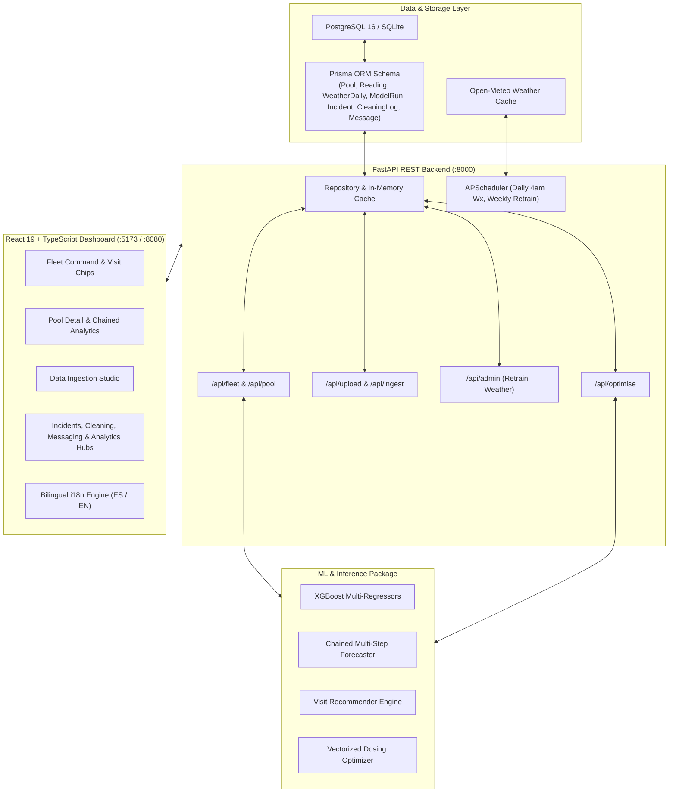

# Pool Predictive Maintenance & Operations System — Complete Technical Explainer

> A comprehensive, end-to-end technical guide explaining the entire Spain (Alicante) Collective-Use Swimming Pool Predictive Maintenance System (V6.0), from raw data ingestion to physical-ML inference and production deployment.

---

## Table of Contents

1. [The Raw Data & Target Fleet](#1-the-raw-data--target-fleet)
2. [Spanish Regulatory Grounding (RD 742/2013)](#2-spanish-regulatory-grounding-rd-7422013)
3. [The Post-Treatment Setpoint Breakthrough](#3-the-post-treatment-setpoint-breakthrough)
4. [External Weather Intelligence (Open-Meteo)](#4-external-weather-intelligence-open-meteo)
5. [Feature Engineering Pipeline (87 Features)](#5-feature-engineering-pipeline-87-features)
6. [Machine Learning Models & Formulations](#6-machine-learning-models--formulations)
7. [Physical Kinetics Rate Integration Engine](#7-physical-kinetics-rate-integration-engine)
8. [Intelligent Visit Recommendation Engine](#8-intelligent-visit-recommendation-engine)
9. [Chemical Dosing Optimization Engine (Vectorized $O(n)$)](#9-chemical-dosing-optimization-engine-vectorized-on)
10. [SHAP Explainability & Physical Validation](#10-shap-explainability--physical-validation)
11. [Production Full-Stack Architecture](#11-production-full-stack-architecture)
12. [Verification, Testing & Test Suite](#12-verification-testing--test-suite)
13. [CLI Reference & Automation](#13-cli-reference--automation)

---

## 1. The Raw Data & Target Fleet

The system operates on historical telemetry and operational logbooks from **Pepe Gutiérrez's pool maintenance enterprise (SPP System)** in Alicante, Spain.

### 1.1 Dataset Specifications
- **Master Dataset (`data/Merged_2023_2026.xlsx`)**: Spans **January 2, 2023 through August 5, 2026**.
- **Raw Volume**: **42,617 rows** across **61 denormalized columns**.
- **Target Scope**: Scoped strictly to community pools equipped with **liquid chlorine dosing pumps** (`data/Listado_piscinas_bomba_cloro.xlsx`).
- **Filtered Fleet**: **135 active community pools** (38,362 validated reading rows). Non-qualifying manual tablet/salt pools (~4,255 rows) are safely excluded.

### 1.2 Multi-Visit Consolidation & Static Imputation
- **Multi-Visit Handling**: On days when technicians visit a pool multiple times (1,061 occurrences), the **last reading of the day** is preserved as the definitive end-of-day pool state, while setting a binary flag `multi_visit_day = 1`.
- **Static Fleet Backfilling**: Physical pool dimensions (volume $m^3$, surface area $m^2$, filter diameter, motor count) are backfilled across historical rows from fleet-wide medians (median volume: $225.0\text{ m}^3$), raising dimension completeness from $1.1\%$ to **$100\%$**.

---

## 2. Spanish Regulatory Grounding (RD 742/2013)

The entire predictive pipeline and alert thresholds are strictly aligned with Spanish national and regional legislation:
- **Real Decreto 742/2013** (National Technical-Sanitary Quality Standards for Swimming Pools).
- **Decreto 85/2018** (Comunitat Valenciana Autocontrol Protocol).

```
 0.0 mg/L      0.5 mg/L       1.0 mg/L        1.5 mg/L       2.0 mg/L                     5.0 mg/L
──┼───────────────┼──────────────┼───────────────┼──────────────┼────────────────────────────┼──▶ Free Chlorine
  │  🚨 BREACH    │  ⚠️ ADVISED  │  ✅ CLIENT    │  ⚠️ MONITOR  │   SPANISH OVERDOSE ZONE    │ 🚨 CLOSURE
  │ (Pathogen     │ (Target Min  │    OPTIMAL    │ (High Cl     │ (Intentional Mediterranean │ (Chemical Burn
  │  Hazard)      │  Breach)     │     RANGE     │  Retention)  │  Buffer: 2.0 – 5.0 mg/L)   │  Hazard)
```

| Parameter | RD 742/2013 Standard | Client Optimal Range | Regulatory & Safety Hazard Condition |
|:---|:---|:---|:---|
| **Free Chlorine** | `0.5 – 2.0 mg/L` | `1.0 – 1.5 mg/L` | `< 0.5 mg/L` (Pathogen hazard 🚨) or `> 5.0 mg/L` (Mandatory closure 🚨)<br>`< 1.0 mg/L` (Maintenance advised ⚠️) |
| **pH** | `7.2 – 8.0` | `7.2 – 7.8` | `< 7.2` (Eye/skin sting, equipment corrosion 🚨)<br>`> 8.0` (Scale formation, disinfectant inefficacy 🚨) |
| **Turbidity** | `≤ 5.0 NTU` | `≤ 1.0 NTU` | `> 5.0 NTU` (Water cloudiness, filtration failure 🚨) |

### The Spanish Mediterranean "60% Chlorine Overdosing" Phenomenon
In Alicante's intense Mediterranean climate (summer UV index $>9.0$, high water temperatures $>28^\circ\text{C}$, and heavy bather surges), technicians intentionally maintain chlorine levels between $2.0\text{ and }4.0\text{ mg/L}$. The system defines safety hazards strictly as $<0.5\text{ mg/L}$ or $>5.0\text{ mg/L}$, preventing false alarms while providing fine-grained optimization towards the client target of $1.0\text{--}1.5\text{ mg/L}$.

---

## 3. The Post-Treatment Setpoint Breakthrough

### The Problem in Historical Logbooks
The historical dataset contains **pre-treatment readings** (confirmed by Jesús Santana, IBERPISCINAS SLU): the technician measures the pool, writes down the initial values, adds chemicals or adjusts pumps, and leaves. 

When predicting water quality at the next visit, treating the initial reading as the start of degradation creates artificial target leakage (models predict "today's reading minus minor decay").

### The Solution: Degradation from Post-Treatment Ideal
Water chemistry in reality degrades **from the post-treatment state** achieved after technician intervention. The V6 system introduces configurable **post-treatment setpoints** ($C_{sp}$):

| Parameter | Configurable Setpoint ($C_{sp}$) | Operational Rationale |
|:---|:---|:---|
| **Free Chlorine** | `2.5 mg/L` | Reflects Alicante field practice (median reading 2.6 mg/L, within RD buffer zone) |
| **pH** | `7.4` | Ideal neutral point within RD 742/2013 range ($7.2\text{--}8.0$) |
| **Turbidity** | `0.5 NTU` | Crystal-clear post-flocculation standard (well within RD $5.0$) |

### Next-Day Target Interpolation Formula
For an inter-visit gap of $k$ days between visit $T_0$ and the next recorded visit $C_{\text{next\_visit}}$:
$$\text{Target}_{\text{tomorrow}} = C_{sp} + (C_{\text{next\_visit}} - C_{sp}) \times \frac{1}{k}$$

- For $k = 1$ (next-day visit): target is the exact next observed reading.
- For $k = 3$: target represents 1 day of degradation from the setpoint toward the next observed state.
- When no next visit exists: target falls back to 1 day of physical kinetic decay from the setpoint.

---

## 4. External Weather Intelligence (Open-Meteo)

Atmospheric variables heavily dictate chlorine photolysis, algae growth, and evaporation. The system integrates high-resolution daily weather data for Alicante ($38.3452^\circ\text{ N}, -0.4815^\circ\text{ W}$) via Open-Meteo:

### 22 Engineered Weather Signals
1. **Current Day Weather (9 features)**:
   - Maximum & Mean Temperature ($^\circ\text{C}$), Max UV Index, Clear-Sky UV Index, Solar Shortwave Radiation ($MJ/m^2$), Sunshine Duration (hours), Precipitation ($mm$), Max Wind Speed ($km/h$), and $ET_0$ Reference Evapotranspiration ($mm$).
2. **Cumulative Weather Since Last Visit (4 features)**:
   - `w_uv_max_since`, `w_solar_radiation_since`, `w_precipitation_mm_since`, `w_temp_mean_since` (accumulated atmospheric burden across the inter-visit gap).
3. **Tomorrow's Weather Forecast (9 features)**:
   - `w_tmrw_*` signals providing forward-looking predictive signals for tomorrow's chemical consumption.

---

## 5. Feature Engineering Pipeline (87 Features)

The feature pipeline (`ml/features.py`) builds **87 numeric features** across several orthogonal signal categories:

1. **Autoregressive Lags & Rolling Statistics**:
   - `chlorine_lag1`, `chlorine_lag2`, `ph_lag1`, `ph_lag2`, `turbidity_lag1`, `turbidity_lag2`
   - 3-visit rolling averages and standard deviations (`chlorine_roll3_mean`, `chlorine_roll3_std`, `ph_roll3_mean`, `ph_roll3_std`, `turbidity_roll3_mean`, `turbidity_roll3_std`)
2. **Regulatory Headrooms**:
   - `chlorine_headroom_low` ($\text{Cl} - 0.5$)
   - `chlorine_headroom_high` ($5.0 - \text{Cl}$)
   - `ph_headroom_low` ($\text{pH} - 7.2$)
   - `ph_headroom_high` ($8.0 - \text{pH}$)
   - `turbidity_headroom` ($5.0 - \text{Turb}$)
   - `min_headroom` ($\min(\text{all headrooms})$)
3. **Setpoint Drift & Kinetic Rates**:
   - `chlorine_decay_rate_from_setpoint` ($(\text{Cl}_{sp} - \text{Cl}) / \max(1, k)$)
   - `ph_drift_rate_from_setpoint` ($(\text{pH} - \text{pH}_{sp}) / \max(1, k)$)
   - `turb_accumulation_rate_from_setpoint` ($(\text{Turb} - \text{Turb}_{sp}) / \max(1, k)$)
4. **Temporal & Calendar Features**:
   - `visit_month`, `visit_day_of_week`, `visit_day_of_year`, `visit_is_summer`
5. **Physical Pool Dimensions**:
   - `pool_volume_m3`, `surface_area_m2`, `filter_diameter_mm`, `motor_count`
6. **Open-Meteo Weather Features**:
   - 9 current-day features + 4 cumulative inter-visit features + 9 tomorrow-forecast features

---

## 6. Machine Learning Models & Formulations

### 6.1 Multi-Regressor Architecture
The machine learning package (`ml/training/`) trains three distinct XGBoost regressors:
- **Model A**: Predicts **Free Chlorine Tomorrow** ($mg/L$)
- **Model C**: Predicts **pH Tomorrow** (pH units)
- **Model D**: Predicts **Turbidity Tomorrow** ($NTU$)

### 6.2 Temporal Train/Test Split
To prevent temporal data leakage, a strict 80/20 chronological split is enforced based on the 80th percentile date (**October 7, 2025**):
- **Training Set**: 29,526 rows ($2023\text{--}2025$)
- **Test Set**: 7,382 rows ($2025\text{--}2026$)

### 6.3 Performance Results

| Model | Target Variable | MAE | RMSE | $R^2$ Score | P90 Error |
|:---|:---|:---:|:---:|:---:|:---:|
| **Model A** | **Free Chlorine Tomorrow** | **0.1972** | 0.3447 | **0.2571** | 0.4503 |
| **Model C** | **pH Tomorrow** | **0.0332** | 0.0538 | **0.2974** | 0.0811 |
| **Model D** | **Turbidity Tomorrow** | **0.0420** | 0.0777 | **0.4013** | 0.0940 |

---

## 7. Physical Kinetics Rate Integration Engine

When technicians visit irregularly ($k \approx 3\text{ days}$), `ml/inference/predictor.py` performs a **Chained Multi-Step Rollout**:

$$\text{Last Visit }(T_0) \longrightarrow T_1 \longrightarrow \dots \longrightarrow T_{\text{today}} \longrightarrow T_{\text{tomorrow}}$$

At each intermediate step $t \rightarrow t+1$, dynamic feature state recomputation is coupled with **first-principles kinetic rate bounds**:

### 1. Chlorine Photolysis Kinetics
$$k_{\text{decay}} = 0.15 + 0.003 \times \max(0, \text{Solar Radiation} - 15.0)$$
$$\text{Cl}_{\text{anchor}} = \begin{cases} \text{Cl}_{sp} & \text{step} = 1 \\ \text{Cl}_t & \text{step} > 1 \end{cases}$$
$$\text{Cl}_{\text{kinetic}} = \text{Cl}_{\text{anchor}} \times \exp\left(-\frac{k_{\text{decay}}}{3.0}\right)$$
$$\text{Pred Cl}_{t+1} = \max\left(0.0, \min(\text{Raw ML Cl}, \text{Cl}_{\text{kinetic}})\right)$$

### 2. Carbonate Equilibrium & $CO_2$ Outgassing pH Drift
$$\Delta\text{pH}_{\text{drift}} = 0.035 + 0.0015 \times \max(0, \text{Temp}_{\max} - 25.0)$$
$$\text{pH}_{\text{anchor}} = \begin{cases} \text{pH}_{sp} & \text{step} = 1 \\ \text{pH}_t & \text{step} > 1 \end{cases}$$
$$\text{Pred pH}_{t+1} = \min\left(8.6, \max(\text{Raw ML pH}, \text{pH}_{\text{anchor}} + \Delta\text{pH}_{\text{drift}})\right)$$

### 3. Wind-Borne Turbidity Accumulation
$$\Delta\text{Turb} = 0.045 + 0.002 \times \max(0, \text{Wind}_{\max} - 10.0)$$
$$\text{Turb}_{\text{anchor}} = \begin{cases} \text{Turb}_{sp} & \text{step} = 1 \\ \text{Turb}_t & \text{step} > 1 \end{cases}$$
$$\text{Pred Turb}_{t+1} = \min\left(5.0, \max(\text{Raw ML Turb}, \text{Turb}_{\text{anchor}} + \Delta\text{Turb})\right)$$

---

## 8. Intelligent Visit Recommendation Engine

The visit recommendation engine (`ml/inference/visit_recommender.py`) dynamically computes the optimal technician visit date by synthesizing:

1. **Immediate Safety Check**: If today's predicted chlorine is $<0.5\text{ mg/L}$ or $>5.0\text{ mg/L}$, or pH is outside $[7.2, 8.0]$, urgency is flagged as **URGENT** with a recommended visit of **Today/Tomorrow**.
2. **Decay Curve Simulation**: Simulates day-by-day forward degradation up to 14 days. The projected day where free chlorine drops below $1.0\text{ mg/L}$ or pH exceeds $8.0$ establishes a hard upper bound.
3. **Seasonal Baseline**:
   - Summer (June–September): 2-day cadence
   - Shoulder (May, October): 4-day cadence
   - Winter (November–April): 7-day cadence
4. **Atmospheric Severity Factor**: Tightens visit window if forecast UV index $> 8.0$ or temperature $> 30^\circ\text{C}$.

---

## 9. Chemical Dosing Optimization Engine (Vectorized $O(n)$)

Located in `ml/inference/optimiser.py`, the chemical dosing optimizer determines the minimum pump workload needed to maintain optimal water balance:
- **Search Space**: Hypochlorite dosing percentage $\in [0\%, 100\%]$ (step $5\%$) $\times$ Pump operating hours $\in [0\text{h}, 24\text{h}]$ (step $1\text{h}$) = **525 configurations**.
- **Vectorized $O(n)$ Evaluation**: Uses numpy broadcasting to evaluate all 525 configurations concurrently in $<2\text{ ms}$.
- **Objective Function**: Minimize chemical effort $(\text{Dosing\%} / 100) \times \text{Hours}$ such that:
  $$\text{Pred Cl}_{\text{tomorrow}} \in [1.0, 1.5]\text{ mg/L} \quad\text{and}\quad \text{Pred pH}_{\text{tomorrow}} \in [7.2, 8.0]$$

---

## 10. SHAP Explainability & Physical Validation

SHAP (SHapley Additive exPlanations) values validate that models learn genuine environmental and chemical physics rather than spurious correlations:

- **Free Chlorine**: Dominated by `visit_is_summer` ($0.2378$), `visit_day_of_week` ($0.0861$), and `chlorine_roll3_mean` ($0.0546$).
- **pH**: Dominated by `ph_roll3_mean` ($0.0151$), `ph_headroom_low` ($0.0096$), and **`ph_drift_rate_from_setpoint`** ($0.0068$).
- **Turbidity**: Dominated by **`turb_accumulation_rate_from_setpoint`** ($0.0123$), `turbidity_roll3_mean` ($0.0115$), and `visit_is_summer` ($0.0115$).

---

## 11. Production Full-Stack Architecture



---

## 12. Verification, Testing & Test Suite

The system maintains a comprehensive 51-test automated suite executed via pytest:

```bash
pytest tests/ -v
```

### Test Coverage Areas
1. **API Contracts (`tests/api/`)**: Health probes, fleet endpoints, query validation, upload parsing, manual reading ingestion, admin retrain.
2. **Machine Learning (`tests/ml/`)**: Dry-run validation, feature calculations, setpoint bound verification, model promotion thresholds, inference parity, and $O(n)$ optimizer speed.
3. **Visit Recommendation (`tests/ml/test_visit_recommender.py`)**: Seasonal baseline cadence, immediate chlorine breach triggering, forward decay curves, and routine scheduling.
4. **Data Store & Caching (`tests/store/`)**: Urgency classification, lookup cache generation, fuzzy column detection, and date parsing.

---

## 13. CLI Reference & Automation

### Train the ML Pipeline
```bash
# Full training run
python pipeline_v6.py

# Or via the ML module
python -m ml.training.train
```

### Run Operational Chained Forecasts via CLI
```bash
# Forecast all active pools
python inference.py

# Forecast a specific pool
python inference.py --pool "Residencial Azahar (461)"

# Run for a specific date
python inference.py --date 2026-08-10
```

### Update Alicante Weather Cache
```bash
python fetch_weather.py --lat 38.3452 --lon -0.4815 --start 2023-01-01 --end 2026-08-10 -o data/weather_alicante_2023_2026.csv
```

### Regenerate Word (.docx) Documentation
```bash
python generate_system_docs_docx.py
python generate_intern_code_guide_docx.py
```
