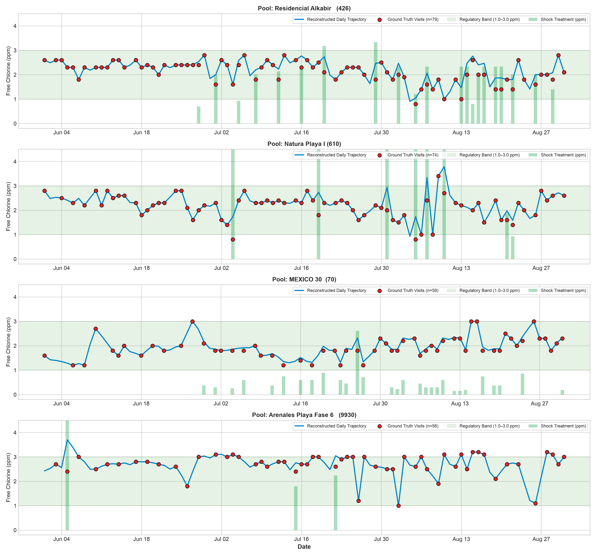

# Daily Pool Trajectory Imputation — Verification Report

**Generated:** 2026-09-03T10:58:38.894421

---

## 1. Dataset Summary

| Metric | Value |
| :--- | :--- |
| Total daily pool records | **156,411** |
| Ground-truth measurement visits | **38,285** (24.5%) |
| Reconstructed intermediate days | **118,126** (75.5%) |
| Unique pools | **138** |

## 2. Data Integrity

| Check | Result |
| :--- | :--- |
| NaN values across all columns | **0** |
| Duplicate (pool, date) rows | **0** |
| Calendar gaps > 1 day | **309** gaps totalling **10,721** pool-days (max single gap: 260 days) |
| Expected columns present | **46/46** (missing: None) |

## 3. Physical Bounds

| Variable | Range | Status |
| :--- | :--- | :--- |
| Free Chlorine | 0.0 – 5.0 ppm | Non-negative |
| pH | 6.0 – 8.5 | Realistic |
| Water Temperature | 14.0 – 33.0 °C | Physical |

## 4. Imputation Quality

| Metric | Value |
| :--- | :--- |
| Mean confidence score (imputed days) | **0.506** / 1.000 |

## 5. Daily Compliance Distribution

| Band | Percentage |
| :--- | :--- |
| Under target (< 1.0 ppm) | 2.56% |
| Compliant (1.0 – 3.0 ppm) | 67.97% |
| Over target (> 3.0 ppm) | 29.47% |

## 6. Trajectory Visualisations

