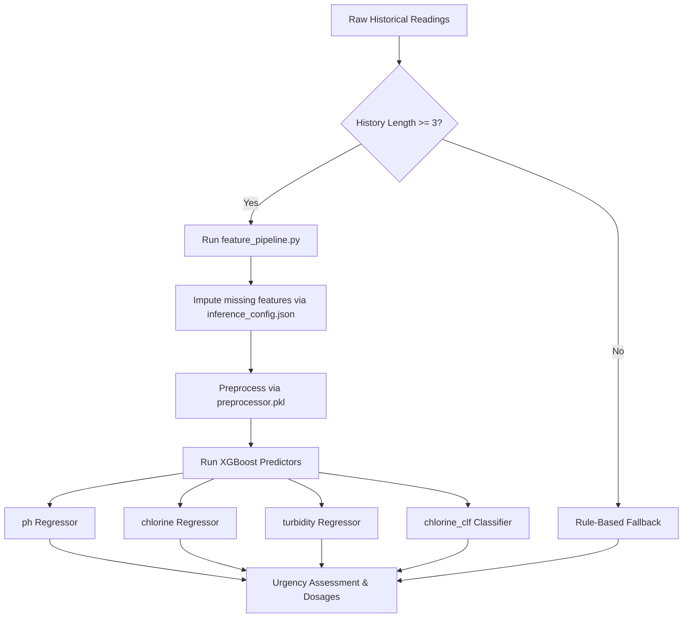

# Swimming Pool Predictive Maintenance System: Complete System Documentation

This document provides a comprehensive technical overview of the pool maintenance predictive system for public and shared pools in the **Comunitat Valenciana, Spain**, regulated under **Real Decreto 742/2013** and **Decreto 85/2018**.

---

## 1. System Overview & Context

Technicians visit pools across the fleet to measure water parameters (**pH, Free Chlorine, Turbidity**). The primary objectives of the predictive maintenance system are:

1. **Visit Scheduling:** Determine the exact timeline before the next inspection is required based on chemical stability.
2. **Water Quality Forecasting:** Predict pH, chlorine, and turbidity levels at the next visit using temporal trends. V6 anchors degradation to a configurable **post-treatment setpoint** (Cl 2.5 mg/L, pH 7.4, Turb 0.5 NTU) since the dataset contains only pre-treatment readings (confirmed by IBERPISCINAS SLU). See `ml/config.py` `SETPOINT_*` constants.
3. **Prescription Engine:** Calculate the precise dosage (in kg) of chemical adjusters (Liquid Sodium Hypochlorite, Sodium Bisulfate, Sodium Carbonate) required at the next visit using mass-balance equations.

---

## 2. Directory & File Structure

The project directory contains the following key components:

```
swimming_pool_eu/
├── data/                                # Raw historical reading logs
│   └── merged_pool_data_2017_2022.csv
├── models/                              # Trained ML models and parameters
│   ├── best_ph.pkl                      # XGBoost pH model
│   ├── best_chlorine.pkl                # XGBoost chlorine model
│   ├── best_turbidity.pkl               # XGBoost turbidity model
│   ├── best_chlorine_clf.pkl            # XGBoost chlorine breach classifier
│   ├── preprocessor.pkl                 # scikit-learn transformers
│   └── inference_config.json            # Model schemas, fill values, medians
├── outputs/
│   └── master_dataset.csv               # Bundled production dataset (138k rows)
├── prototype_ui/                        # Web Dashboard components
│   ├── app.py                           # Flask server and prediction API
│   ├── index.html                       # Frontend Single Page Dashboard
│   ├── feature_pipeline.py              # Extracted feature engineering code
│   └── README.md                        # UI startup instructions
├── venv/                                # Python virtual environment
├── pipeline_v3.py                       # Reference training pipeline script
└── system_documentation.md              # Complete system documentation
```

---

## 3. Water Quality & Safety Regulations

Water parameter bounds are strictly aligned with Spanish state (**RD 742/2013**) and regional (**Decreto 85/2018**) regulations:

| Parameter         | Minimum Limit      | Ideal Target        | Maximum Limit      | Chemical Treatment                                      |
| ----------------- | ------------------ | ------------------- | ------------------ | ------------------------------------------------------- |
| **Free Chlorine** | $0.5\,\text{mg/L}$ | $1.25\,\text{mg/L}$ | $5.0\,\text{mg/L}$ | **Sodium Hypochlorite 15%** (Cloro Líquido)             |
| **pH**            | $7.2$              | $7.2$               | $8.0$              | **Sodium Bisulfate** (pH-) / **Sodium Carbonate** (pH+) |
| **Turbidity**     | —                  | —                   | $5.0\,\text{NTU}$  | **Flocculant** (Coagulante)                             |

---

## 4. Feature Engineering Pipeline (`feature_pipeline.py`)

To generate inputs for the XGBoost models, raw chronological readings for a pool are compiled and transformed into tabular features. The logic is exported into `feature_pipeline.py`.

### A. Raw Data Prerequisites

- **Date Parsing:** Flexible parsing handles ISO, standard, and Spanish date-time formats, converting all dates to `datetime` objects.
- **Chronological Sorting:** Readings are sorted ascending by date to ensure lags and trend gradients represent correct chronological steps.

### B. Engineered Temporal Features

1. **Lags:**
   - `ph_lag_1`, `ph_lag_2`: pH values from the previous two visits.
   - `free_chlorine_lag_1`, `free_chlorine_lag_2`: Chlorine levels from the previous two visits.
   - `turbidity_lag_1`, `turbidity_lag_2`: Turbidity values from the previous two visits.
2. **Intervals:**
   - `days_since_last_visit`: Days elapsed between visit $T-1$ and $T$.
3. **Rolling Metrics:**
   - 3-visit rolling means: `ph_roll_mean_3`, `free_chlorine_roll_mean_3`, `turbidity_roll_mean_3`.
   - 3-visit rolling standard deviations: `ph_roll_std_3`, `free_chlorine_roll_std_3`, `turbidity_roll_std_3`.
4. **Trend Velocities (Rate of Change):**
   - Gradients representing rates of change: `ph_velocity`, `free_chlorine_velocity`.
5. **Headroom & Historical Breaches:**
   - `min_headroom`: The smallest normalized distance to any regulatory limit among chlorine, pH, or turbidity.
   - `chlorine_breach_count`, `ph_breach_count`: Cumulative count of safety violations recorded for the pool over its entire history.
6. **Date Extraction:**
   - `visit_month`: Extracted month (integer $1\text{--}12$) used to map seasonal medians.

---

## 5. Machine Learning Inference & Architecture

The system uses 4 trained XGBoost models to calculate predictions. These models are loaded once at startup and are applied only when a pool has **at least 3 historical readings**.



### A. Preprocessing (`preprocessor.pkl`)

Features are aligned to the training schema. Categorical features (`pool_type`, `deck_type`) are encoded using one-hot mapping, and numeric arrays are imputed and scaled. Unknown values default to `'unknown'`.

### B. Predictors

1. **Water Quality Forecasts:**
   - Predict target chemical levels for the next visit. Output is saved as `predicted_next` (`ph`, `free_chlorine`, `turbidity`).
2. **Breach Classifier:**
   - Predicts the probability that the pool's chlorine level will drop below the regulatory threshold ($0.5\,\text{mg/L}$) before the next visit. Outputs a percentage value `breach_proba`.

---

## 6. Urgency and Visit Scheduling

The visit interval (`recommended_days`) is determined by a ruleset based on chemical need.

```
                    Urgency & Schedule Matrix
┌───────────────────┬───────────────────┬──────────────────────────────┐
│ Urgency Category  │ Recommended Days  │ Triggering Rules             │
├───────────────────┼───────────────────┼──────────────────────────────┤
│ Immediate         │ 1 Day             │ - Current Chlorine < 0.5     │
│                   │                   │ - Current pH < 7.2 or > 8.0  │
├───────────────────┼───────────────────┼──────────────────────────────┤
│ Soon              │ 3 Days            │ - Predicted Chlorine < 0.5   │
│                   │                   │ - Predicted pH < 7.2 or > 8.0│
│                   │                   │ - Predicted Turbidity > 5.0  │
│                   │                   │ - Breach Prob. >= 30%        │
│                   │                   │ - Headroom < 0.3             │
├───────────────────┼───────────────────┼──────────────────────────────┤
│ Extended          │ 30 Days           │ - All parameters stable and  │
│                   │                   │   within limits.             │
└───────────────────┴───────────────────┴──────────────────────────────┘
```

- **ML Mode Scheduling:** Follows the logic above based on current and predicted levels.
- **Rule-Based Fallback Scheduling:** Follows the logic above based on current levels alone. Safe pools default to 30 days.

---

## 7. The Prescription Engine

Calculates dosage requirements for the next visit using standard mass-balance equations based on target concentrations.

### A. Chlorine: Liquid Sodium Hypochlorite 15%

- **Rationale:** Liquid Sodium Hypochlorite 15% concentration provides approximately $150\,\text{g}$ of active chlorine per kg of product. Raising $1\,\text{m}^3$ of water by $1\,\text{ppm}$ ($1\,\text{mg/L}$) requires $1\,\text{g}$ of active chlorine, which is equivalent to $0.00667\,\text{kg}$ of the 15% product.
- **Equation:**
  $$\text{Dosage (kg)} = \max\left(0, (1.25 - \text{predicted chlorine}) \times \text{volume} \times 0.00667\right)$$
  _(Ideal target concentration is $1.25\,\text{mg/L}$)_

### B. pH Corrector: Sodium Bisulfate (pH-)

- **Rationale:** Adding $1.5\,\text{kg}$ of Sodium Bisulfate lowers the pH of $100\,\text{m}^3$ of water by approximately $0.2$ units. This equates to $0.0075\,\text{kg}$ per $\text{m}^3$ for every $0.1$ unit reduction.
- **Equation:**
  $$\text{Dosage (kg)} = \frac{\text{predicted pH} - 7.2}{0.1} \times \text{volume} \times 0.0075$$
  _(Triggered if pH $> 7.6$; targets an ideal pH of $7.2$)_

### C. pH Corrector: Sodium Carbonate (pH+)

- **Rationale:** Adding $1.0\,\text{kg}$ of Sodium Carbonate raises the pH of $100\,\text{m}^3$ of water by $0.1$ units. This equates to $0.01\,\text{kg}$ per $\text{m}^3$ for every $0.1$ unit increase.
- **Equation:**
  $$\text{Dosage (kg)} = \frac{7.2 - \text{predicted pH}}{0.1} \times \text{volume} \times 0.01$$
  _(Triggered if pH $< 7.2$; targets an ideal pH of $7.2$)_

---

## 8. Dashboard Backend API (`app.py`)

A Flask web server handles page serving, manual entry, file uploads, and model evaluation.

### A. API Endpoint Reference

| Method | Endpoint           | Parameters         | Response Description                                                         |
| ------ | ------------------ | ------------------ | ---------------------------------------------------------------------------- |
| `GET`  | `/api/status`      | None               | Loaded model health status, data source name, active pool/row counts         |
| `GET`  | `/api/fleet`       | `date` (optional)  | List of all pools in fleet, showing current stats, urgency, and model badges |
| `GET`  | `/api/pool`        | `id` (required)    | Complete pool profile, history list, forecasts, and chemical prescriptions   |
| `GET`  | `/api/pool-ids`    | None               | Sorted list of all active pool names for form autocomplete                   |
| `GET`  | `/api/dates`       | None               | Bounds of dates in active dataset (min, max, count)                          |
| `POST` | `/api/upload`      | `file` (form-data) | Uploads CSV/XLSX, returning parsed columns and suggested mappings            |
| `POST` | `/api/map-columns` | `mapping` (JSON)   | Configures selected mapping, builds dataset, and reloads fleet               |
| `POST` | `/api/add-reading` | `body` (JSON)      | Validates and appends a single manual reading to a pool                      |
| `POST` | `/api/reset`       | None               | Resets local in-memory dataset back to demo baseline                         |

### B. In-Memory DataStore Mechanics

Data is stored in-memory using a `DataStore` object:

- **Snapshot State:** Upon startup, the initial demo state is snapshotted using a deep copy. Resetting restores this snapshot.
- **Surgical Updates:** Submitting a manual reading via `insert_reading()` performs a targeted single-pool update. Instead of recalculating ML features for all 475 pools, only the modified pool's features and predictions are re-run. This optimization reduces insertion latency from $\sim 60\,\text{s}$ to $<100\,\text{ms}$.

---

## 9. Dashboard UI Features (`index.html`)

The user interface is built as a single-page dark-themed dashboard.

1. **Global Model Status Indicator:**
   A status indicator in the top navbar shows current ML model availability:
   - `🤖 XGBoost models loaded (≥3 readings → model mode)`
   - `⚠️ Rule-based fallback active`
2. **Dynamic Fleet Badges:**
   The fleet listing shows the prediction source for each pool:
   - `🤖 Model`: Model-based prediction
   - `📋 Rule-based`: Rule-based fallback
3. **Detail View Modal:**
   Clicking a pool displays a modal showing:
   - Forecast values with a badge indicating the source.
   - Actionable prescriptions detailing dosages.
   - An interactive history progress bar when a pool is in fallback (e.g., `2 of 3 readings needed for model inference`).
   - Tooltips highlighting default parameters (e.g., assumed volume) applied by the pipeline.
4. **Data Upload Modal:**
   Allows importing custom CSV/XLSX files. Features fuzzy column matching to auto-detect ID, date, pH, chlorine, and turbidity fields, and reports validation errors and skipped rows.

---

## 10. Verification Tests (`test_inference.py`)

A validation script (`scratch/test_inference.py`) tests the system's prediction logic using mock requests:

- **Test 1 (Demo Match):** Checks that demo pools with $\ge 3$ readings route to ML models and yield valid numerical outputs.
- **Test 2 (Fallback):** Verifies that a pool with 1 reading defaults to rule-based fallback and displays a status explanation.
- **Test 3 (3+ Flip):** Submits 3 sequential readings to a new pool to verify that it transitions from rule-based fallback to ML mode.
- **Test 4 (Upload):** Tests importing and mapping a 5-reading CSV file to verify correct feature pipeline execution.
